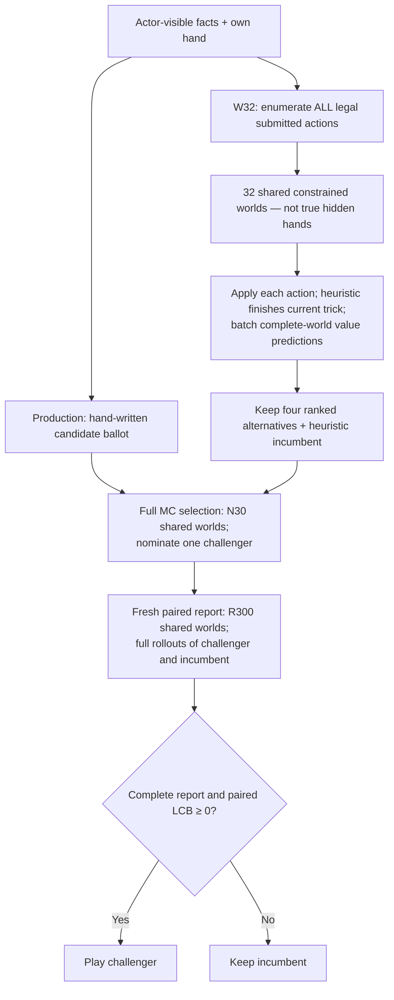

# AI policy ledger

Last reconciled: **2026-09-16 (release 28: JS-M1 joint model as one package)**. This file defines the current callable-policy
contract and the scientific conclusions that constrain policy work. It is not
a run log or policy registry duplicate.

- Exact policy implementations and names: `server/shengji/ai/registry.py`
- Production selection: `fly.toml`
- Current priorities and review gates: `BACKLOG.md` and `HANDOFF_ACTIVE.md`
- Research architecture and model lineage: `RL_PLAN.md`
- Immutable verdicts, hashes, and reviewer corrections: `HANDOFF_REVIEW.md`
- Engine and sampler contracts: `server/tests/` and `incidents/` (ledger archived at `docs_archive/correctness-through-2026-09-22.md`)
- Runtime performance and deployment: `DEPLOY.md` and issue #208 (the speed record is archived at `docs_archive/perf-through-2026-09-22.md`)

Historical detail remains in Git history and `docs_archive/`. Do not append
dated status blocks here.

## Production contract

The current live Fly snapshot is release 28: **the JS-M1 joint model as ONE
package** (value net + its own policy head as the admission prior + hybrid bury).

The current selection is:

```toml
SHENGJI_BOT = "mc-shortlist-0d17fd03-w32-r0d610b62-prior-0d17fd03-bury-hybrid-003c2abe49ff"
SHENGJI_CWV_SHORTLIST_CKPT = "/data/models/js-m1-0d17fd03.npz"
SHENGJI_CWV_PRIOR_CKPT = "/data/models/js-m1-0d17fd03.npz"
SHENGJI_CWV_PRIOR_SHA256 = "0d17fd03aee759cc8de50083c062e8b11a85bdd8cf2bdda95213b73f431fd747"
SHENGJI_CWV_PRIOR_THRESHOLD = "1000"
SHENGJI_CWV_PRIOR_TOP = "256"
SHENGJI_CWV_BURY_ARM = "hybrid"
SHENGJI_CWV_BURY_SERVING_BUDGET_SECONDS = "2"
SHENGJI_FAST = "1"
```

The name is derived by the registry from that environment (the package SHA, the
W32/N30/R300 recipe digest, the prior SHA and the bury identity); it is never
hand-written. `/healthz` reports the policy name and the prior's on-disk SHA,
threshold and top. The server source fallback is `mc` when `SHENGJI_BOT` is
absent. Rollbacks, in order of proximity: release 27 (M1 + separate prior v2,
two packages), release 24 (`fd6bb411` + hybrid bury), `mc-s0-report-lcb`.
Changing the checkpoint, the prior threshold/top, N/R work, ballot, sampler,
continuation or confidence rule is a new policy and needs fresh evidence.
Release records, images and the exact rollback environments are in `DEPLOY.md`.

### Policy prior admission — deployed (releases 27 and 28)

Below 1,000 legal actions the value net ranks every legal action (unchanged
from the original W32 design). Above 1,000, the policy prior runs once per
sampled world on a root clone of that world (never the true hidden hands);
each world's top 256 actions are unioned with production's own anchor
candidates (median pool about 600 of a bound 8,192, roughly 5% of the legal
set), and only that pool is ranked. The final shortlist (incumbent plus four
alternatives) and the MC selection/report stages are unchanged. Every recipe
field is bound in the policy name (`cwv_shortlist.PRIOR_RECIPE_FIELDS`), the
admission trace records union size, anchors and pool size per decision, and
the 300 s total play deadline stays as the backstop.

Evidence (2026-09-15, capped screens; the release 24 recipe is the control):
paired with M1 on ten shared seeds the prior changed outcomes by
`−0.0003 [−0.0017, +0.0012]` (no resolved difference; a paired estimate, not an
equivalence test); on ten fresh windows M1 + prior read
`+0.0073 [−0.0087, +0.0233]` (MDE80 0.023) with 0 decisions over 60 s and 0 cap
hits in 365,414 (release 24 recipe on the same deals: 161 and 7) at 0.79× its
decision wall; threshold 1,000 versus 10,000 read `−0.0006 [−0.0026, +0.0014]`
paired (no resolved difference) at 0.72× that arm's wall with no decision over
9.9 s in those five windows. Twenty fresh windows of the M1 family pooled `+0.0140 [+0.0026, +0.0254]`
against release 24.

### JS-M1 — the joint model (release 28)

`a5248cc5`: M1's recipe (residual d4 trunk, 176k afterstate corpus, outcome +
search-mean + points heads) trained from scratch for 20 epochs with a 54-card
policy head at weight 0.2, one root batch per value batch streamed from the
full root-row cache (20.3M mover-encoded root decisions on the 140,800 fit
deals). Offline: val CE 0.5957 (M1 0.5975), regret@4 0.0306, holdouts at or
better than M1; policy head on the 15,517 common test-deal rows: listwise CE
0.858 (prior v3 0.975), top-64 recall non-inferior to the separate prior on
four of five strata and better on the two wide partial strata (the 10k+
stratum, 67 deals, is unresolved). In play as one net (five capped windows,
seeds 13260910..13660910): `+0.0239 [+0.0005, +0.0472]` vs the release 24
recipe (nominal, shared-control seeds), paired `+0.0057 [−0.0163, +0.0277]` vs
release 27 at the same decision wall (no resolved difference, not an
equivalence result), 0 decisions over 60 s in those windows. Served as one
NumPy package (schema v2 with the policy head, `server/shengji/ai/cwv_numpy.py`);
the prior admission loads the same file as kind `joint-numpy`. The earlier
joint attempts continued from M1 on 1.0M root rows (J1 weight 1, J2 weight 0.2,
J3 stop-gradient) all trailed the separate prior offline; the from-scratch run
on all root rows closed that gap. Extension to ten windows and fresh seeds are
still owed; JS-G1 (the grid trunk on the same data) and a JS-M1-teacher corpus
(Perf, runJS1) are in progress.

### Serving qualification — every deploy

1. Decision-identity gate (`server/scripts/cwv_serving_gate.py --serving
   --threshold 1000`): the NumPy packages must reproduce the Torch checkpoints'
   decisions (action, RNG state, shortlist and means, admission trace) on 60
   rounds at the serving recipe with the prior exercised; near-tie reorders
   with the same play are reported separately, never folded into "identical".
2. Server-path smoke (`server/scripts/cwv_serving_smoke.py`): build the bot
   from the fly.toml environment exactly as the server does and play bury and
   play turns through `_paced_bot_step` / `_commit_bot_turn`. Release 25 passed
   the gate and stalled every live bot turn because nothing took this path; it
   now precedes every deploy.
3. Packages SHA256-verified on the volume; `/healthz`; a live room's log showing
   a bot bury and bot plays completing.

### Hybrid bury integration — deployed

PR [#323](https://github.com/jerryyyu/shengji/pull/323) merged at `ec7f27ad`.
The deployed policy is
`mc-shortlist-fd6bb411-w32-r55d379a3-bury-hybrid-c93a9877ae6a`, using unchanged
compact package `fd6bb411` / source `3cd27716`, a 2-second cooperative deadline,
and heuristic fallback. Those deadline/fallback semantics are serving policy;
the research recipe had no deadline or fallback. In 1,976 fixed deals, hybrid
versus heuristic measured `+0.03644` utility `[+0.01164,+0.06024]` and `+1.62`
pp win rate `[+0.56,+2.68]`; hybrid versus MC-only was unresolved. Kitty bonus
at least 80 occurred 4 times for hybrid versus 0 for heuristic, so the average
gain does not remove tail-risk. See the [final bury report](docs_archive/value-guided-bury-dev-2026-09-08.md).

### `mc-s0-report-lcb`

The former live champion, now the rollback/reference policy, uses two independent search stages:

1. the complete `mc-strong` N=30 ballot/search nominates one challenger to the
   heuristic incumbent; and
2. the fixed pair is compared on R=300 fresh shared hidden worlds.

The challenger replaces the incumbent only when the one-sided paired lower
confidence bound is at least the zero threshold (equality is accepted). Short
or invalid report folds fail back to the incumbent. The fresh 2,048-cluster
confirmation measured
`+0.338379 +/- 0.067706` signed levels against `mc-strong`; its collision-free
matched extra-work null was `-0.019043 +/- 0.068270`. This establishes the
registered one-round policy—not arbitrary extra search—as the only confirmed
and deployed strength gain.

## Callable policy families

`server/shengji/ai/registry.py` is authoritative when this summary and source
ever differ.

| family | intended use | current status |
|---|---|---|
| `heuristic` | Stateless legal baseline and stable Elo anchor. | Supported baseline, not production. |
| `smart`, `smart-v1`, `smart-v2` | Public-memory heuristics: card counting, boss/void inference, point flow, safe throws, ruff risk, bury and endgame rules. | Supported baselines and rollout policies. Exact lineage stays source-bound. |
| `mc`, `mc-lite`, `mc-strong`, `mc-vstrong` | Determinized Monte Carlo at named work levels. `mc` is the source fallback; `mc-strong` is N=30 and a historical rollback. Current rollback boundaries are above. | Supported. A legal sampler is not a calibrated belief model. |
| `mc-s0-*`, nulls, prefix policies | Frozen search/report experiments and matched controls. | Experiment/reproduction only unless `fly.toml` names one. |
| structured-bury, exact-endgame, point-banking, pair/throw and ballot variants | Mechanism-specific experimental constructors. Some intentionally remain outside the global registry to preserve evidence identity. | No production authority. |
| learned checkpoint policies (`rl`, V11, teacher, Direct-Q and successors) | Offline diagnostics, bounded proposals/rankers, or explicitly reviewed experiments. | Lazy/opt-in only, except the exact W32 package named in the production contract above. |
| `mc-cwv-<ckpt8>-w<W>`, `mc-cwv-prior-<ckpt8>-w<W>` | One-ply search whose ENTIRE evaluator is the complete-world value net (`ai/cwv_policy.py`): production's ballot and sampler, W sampled worlds, every (candidate, world) afterstate scored in one batch, argmax of the mean. The `prior` twin is the no-learning control (same positions, the training receipt's stratified prior as the value, in the prior's own utility scale -- PT0 integer levels for the training build's `baselines` prior, with exact terminals converted to match). Registered by `register_cwv_policies` or `SHENGJI_CWV_CKPT`; the checkpoint id is part of the name and a checkpoint whose encoder identity differs from `value_afterstate`'s is refused. | Dev screen only (`scripts/cwv_duel.py`, budget ladder 1x/3x/10x of production's wall). No strength claim; no production authority. |
| `mc-s0-report-lcb-x3`, `-x10` | Production with its selection and report doses scaled together (N=90/R=900, N=300/R=3000): production's own compute curve, the bar a learned arm must beat at each budget. | Reference arms for the ladder only. |
| `mc-shortlist-<ckpt8>-w<W>` (`CWVShortlistBot`; DEV) | Exhaustive legal actions ranked by the complete-world model over W sampled worlds; K4 or K8 alternatives plus incumbent go to full N30/R300 MC. Unlike `mc-cwv-*`, the model does not replace the final rollout evaluator. Registered by `register_cwv_shortlist_policies` or `SHENGJI_CWV_SHORTLIST_CKPT` so `make_bot` (and `harvest/trajectory.py --policy`) can reach it; the entry point REFUSES to hand back anything that is not a `CWVShortlistBot`, because `mc-cwv-<ckpt8>-w32` is the one-ply bot, not this one. | W32 PLAY and hybrid BURY are live in release 22, with bounded heuristic fallback. See below. |

Example local selection:

```bash
SHENGJI_BOT=smart uv run shengji-server
```

Programmatic construction should always pass a deterministic policy seed:

```python
from shengji.ai.registry import make_bot

bot = make_bot("mc-strong", seed=1234)
```

## Experimental W32 shortlist

**Historical screen supporting the now-deployed model-to-search approach.** The
model helps decide *which moves deserve expensive search*; it does not need
to replace search's final value estimate. W32 means **32 ranking worlds**, not
32 moves or 32 levels of tree search. The tested shortlist contains at most
five actions: four model-ranked alternatives and the heuristic incumbent.

### Production MC vs W32



The two branches are **alternative policies**, not two ballots merged during
one turn. Forced/bypass decisions are omitted from this search-path diagram.
W32 disables production's tractor-lock bypass to expose the full legal set;
its final selection, rollout continuation, point-shy handling and report rule
are otherwise inherited. Cheap ranking has a separate RNG stream and cannot
consume selection/report randomness. Predictions choose the shortlist only;
they never enter the final LCB calculation. This is root shortlisting, **not
recursive MCTS/PUCT**, and has no dependency on the retired BELIEF model.

The A+B+C checkpoint is a trajectory-trained **complete-world MLP with an
auxiliary points head**. Ranking uses expected signed levels from its outcome
distribution, not the auxiliary points output. At runtime all hidden inputs
are replaced by sampled compatible hands/burial. Terminal leaves use exact
engine outcomes. A training architecture preference does not change the
identity of this measured checkpoint.


[Open the standalone W32 pipeline explainer](docs_archive/visuals/2026-09-05/shortlist-anatomy.html)

### Measured result and scaling

Same 256 deal clusters / 512 mirrored **rank-2** rounds, seed0 `90260904`.
Learned arms fix the A+B+C checkpoint. Utility is signed levels per round, **not extra
wins**. Intervals below are 95% paired-deal bootstrap intervals.

| Arm vs ordinary production N30/R300 | Utility [95% interval] | Measured decision wall / opponent |
|---|---:|---:|
| Production x3 (N90/R900) | +0.0684 [0.0000, +0.1367] | 2.96× |
| Production x10 (N300/R3000) | +0.1055 [+0.0351, +0.1777] | 9.89× |
| Original W32, N30/R300 | **+0.1387 [+0.0645, +0.2168]** | 10.61× |
| Optimized W32, N30/R300 | **Identical saved decisions and outcomes** | **3.53×** |
| Optimized W64, N30/R300 | +0.0957 [+0.0293, +0.1661] | 6.27× |
| Optimized W32, N60/R600 | +0.1211 [+0.0469, +0.1915] | 4.49× |

Static encoding and bounded successor/tensor reuse reduced W32 decision wall
by **64.9% (2.849× faster)**. All 256 normalized saved cluster traces matched;
the optimized replay is engineering evidence, not 256 new independent deals.
The parallel job became 2.006× faster; that is distinct from decision latency.

The like-for-like contrasts against W32 matter more than comparing table
point estimates:

- **Extra ranking worlds:** W64 − W32 = −0.0430 [−0.0957, +0.0078], at
  **70.4% more arm decision wall**.
- **Extra final rollouts:** N60/R600 − N30/R300 = −0.0176
  [−0.1192, +0.0723], at **25.8% more arm decision wall**.
- **Extra-compute production control:** original W32 − production x10 =
  +0.0332 [−0.0724, +0.1368], with near-identical total arm decision wall.
- **Cheaper production control:** optimized W32 − production x3 =
  +0.0703 [−0.0234, +0.1660], but their costs
  are not exactly matched (3.53× vs 2.96×).

All four intervals cross zero. The extra-budget arms have **no demonstrated
payoff here**, not proof that more search never helps. Comparisons share
opened DEV deals and a common production opponent; they are not direct
candidate-vs-candidate duels, independent confirmation, or evidence across all
trump ranks. Engineering preserves the positive screen at much lower cost;
equal-compute superiority was not established by this screen. At its conclusion
the optimization was opt-in; deployment happened later under the serving
qualification described above, not as part of this experiment.

Full source/checkpoint identities, raw-artifact locations, counters and the
MC2 inherited-summary-label caveat are in the
[completed run record](https://github.com/jerryyyu/shengji/blob/114f4fc71c55358cf80f364850cb60e2c25c5979/server/runs/cwv_full_legal_shortlist_dev_20260905.md).
Use that A+B+C readout, not the older A+B screen or a directory named `3x`, for
this milestone. [Next steps](RL_PLAN.md#current-decision-tree) and
[shortlist tracker #248](https://github.com/jerryyyu/shengji/issues/248) keep
policy scaling separate from engineering. No production configuration changed.

### Fresh 13-rank check

On a separate 260-deal / 520-round population balanced over all 13 ranks,
the same optimized K4 recipe measured **+0.06154** signed levels per round
(95% deal-clustered CI `[-0.00577,+0.13462]`), with a 52.5% win rate.
This broader-rank result is **inconclusive**, not a confirmed generalization
of the rank-2 win. Actual declarations included 50 no-trump rounds; rank
diversity and no-trump coverage are separate observations. Decision wall was
4.745× production, and the 16-worker job finished in 22m53s. Both deals and
ranks changed, so the smaller point estimate does not isolate a rank effect.
[Recipe, coverage and retained artifacts](server/runs/cwv_rank_diverse_dev_20260906.md).

### K8 wider-shortlist screen

The completed K8 screen used the same A+B+C checkpoint, W32/N30/R300,
batch-128 static encoding/reuse, and 256 paired rank-2 deals (512 rounds),
but admitted eight alternatives rather than K4's four. K8 versus production
was **+0.08203** signed levels/round (95% CI `[+0.00972, +0.15430]`). The
direct K8 − K4 contrast was **−0.05664** (95% CI `[-0.11328, -0.00391]`;
17 favorable, 32 unfavorable, 207 tied clusters). Keep K4; do not escalate
to K16. K8 took 16m10.35s at 15.76 mean cores, but its wider shortlist is a
different policy, so this is not a pure timing A/B. This remains an
exploratory DEV screen with no promotion or deployment authority. The
[authoritative readout](https://github.com/jerryyyu/shengji/pull/257#issuecomment-5557759351)
records the result and archive identity.

<a id="double-shortlist-and-adaptive-allocation"></a>

### Completed allocation and depth screens

The one-extra-trick screen completed on 26 broader-rank deals. Learned inner
ranking versus flat W32 scored −0.09615 levels/round (95% CI
[−0.34615,+0.15385]); uniform inner continuation scored −0.07692
[−0.25000,+0.09663]. Both are inconclusive. Their measured decision-wall
ratios were 116.242× and 7.627× their respective flat opponents. These are
separate matches, not additive effects or a direct learned-versus-uniform
contrast. Full artifacts and cost attribution are in
[the scaling ledger](https://github.com/jerryyyu/shengji/issues/248).

The subsequent direct matches against flat ABC W32 also completed, each on
the same 260 opened broader-rank deals / 520 mirrored rounds:

| Treatment vs flat W32 | Signed levels/round [95% deal interval] | Decision wall / flat |
|---|---:|---:|
| Adaptive root allocation | +0.00577 [−0.05774, +0.07308] | 0.9666× |
| Selective one-extra-trick guidance | −0.00577 [−0.06736, +0.05769] | 1.5892× |

Neither establishes a strength improvement or equivalence. Both treatments
actually ran: adaptive pruning occurred on 50.39% of contested decisions;
selective guidance triggered on 59.18% and used 2.0227× continuation rollouts.
The timing ratios compare different policy trajectories, **not isolated
engineering speedups**. Do not add these effects to W32-versus-production
results or treat the reused populations as independent confirmations.

Both screens covered 40 rounds at every rank and actual suits C 92 / D 124 /
H 126 / S 128 / NT 50. Full recipes, intervention counters and retained evidence:
[adaptive readout](https://github.com/jerryyyu/shengji/blob/268be9c214a8f985bdefe17fbff2455de40701cc/server/runs/cwv_adaptive_root_20260906.md),
[selective-depth readout](https://github.com/jerryyyu/shengji/blob/994049e8d9646e97babf1cd39df164e7c76b6cb2/server/runs/cwv_selective_depth_20260906.md).
Keep flat optimized W32/K4/N30/R300. Further unchanged-recipe/all-world depth
escalation and threshold sweeps are parked; these finite negative/inconclusive
screens do not prove that every adaptive or deeper search will fail.

### Points-leaf gameplay diagnostic

The separate [W32 points-leaf screen](https://github.com/jerryyyu/shengji/blob/d2d08f2569e75fbbbcc3076c4630877f63d4aa21/server/runs/w32_points_leaf_gameplay_20260908.md)
(#302) completed 52 reused broader-rank deals / 104 mirrored rounds per arm.
Against each checkpoint's retained flat W32 on those same deals, one-trick
points leaves scored **−0.1250 [−0.3462, +0.0865]** for default LR and
**+0.0288 [−0.2212, +0.2788]** for lower LR; the checkpoint×consumer interaction
was +0.1538 [−0.0962, +0.4135] levels/round. Neither demonstrates an improvement.
Auxiliary outcome MAE was 12.328 versus 11.746 points, but absolute outcome
error is not paired-action error and does not determine gameplay power.
Keep flat W32; this inconclusive screen does not close learned leaves as a class.

### Further decision-preserving engineering

The later fused static-input A/B in [#288](https://github.com/jerryyyu/shengji/pull/288)
reduced total decision time on two saved zero-reuse follows from 522.75 to
392.34 seconds combined (**1.3324× faster / 25% less wall**), preserving
scores, decisions, work and RNG in all nine tested pairs. The seven-state
small/lead panel was neutral overall; one small state was 7.3% slower in the
single paired pass. This is **not a whole-game, regression-free or strength
claim**, and its ratio must not be multiplied into earlier different-host
measurements. [Exact source and retained measurement](https://github.com/jerryyyu/shengji/blob/cd65cb99f84d80d9f6880bc4dcf9b2b57c66aa8c/server/runs/cwv_fused_static_20260906.md).
This result does not authorize changing a live run or production defaults.

## Search and heuristic behavior that survives

These are governing conclusions, not an invitation to reproduce old toggle
grids in this document.

- N=30 Monte Carlo clearly improved on the smaller base search. Uniform N=60
  did not establish another gain.
- The conservative disjoint R=300 report fold is the confirmed improvement.
  Alternative confidence and adaptive-allocation recipes did not establish an
  additional winner.
- The heuristic incumbent must remain candidate zero. Tractor-lock,
  point-shy near-tie handling, deterministic ballot order, and exact work
  counters are policy identity.
- Public memory may use declarations, plays, voids, remaining-pair/run bounds,
  actor-private hand, and banker-private burial where applicable. It may not
  read other hidden hands or a non-banker burial.
- Safe-shuai, boss/pair/tractor, point-flow, ruff-risk, void-building, and
  endgame heuristics are useful parents and diagnostics. Their presence is not
  evidence that every fallback is strong; production-policy quality gaps must
  be replayed and attributed to legality, ballot, world sampling,
  continuation, or value before patching.

The old exhaustive toggle table is preserved in Git history. Source owns what
is currently enabled; old head-to-head rates are screening evidence, not
production claims.

## Current scientific conclusions

| lane | conclusion for policy work |
|---|---|
| **RLCB** | The confirmed MC-LCB search; still the screen baseline. Superseded in production by the model-guided shortlist (W32, then M1 + prior, then the JS-M1 joint model). |
| **M1 / policy prior v2 / JS-M1 (2026-09)** | M1 confirmed on fresh deals (+0.0212 [+0.0036, +0.0387]); the prior's paired contrast with M1 is −0.0003 [−0.0017, +0.0012] (no resolved difference) with 0 decisions >60 s in the 365k observed; JS-M1 as one net reads +0.0057 [−0.0163, +0.0277] paired vs the two-model arm (no resolved difference, not established non-inferiority) and +0.0239 [+0.0005, +0.0472] vs release 24 at five (nominal). Deployed as release 28; ten-window and fresh-seed reads owed. |
| **Global learned rankers / V11 / Direct-Q / teacher direct play** | Better label fit or isolated proposal signal did not transport into a stronger whole-game policy. Keep learned scores bounded to their reviewed role. |
| **S4 point banking, S6 shuai sourcing, pair-aware continuations** | Mechanisms were plausible or locally positive but no registered whole-game successor cleared the required bar. Do not revive them as unchanged retries. |
| **T4 model proposal** | Selected none. The uninformed widening control was positive against champion but used 14.8% more accepted worlds and 80.9% more searches; it requires a three-arm compute/candidate attribution test. |
| **BELIEF R4/R5** | R4's preserved synthetic-primary cohort reduced held-out count Brier by 21.40% versus REF-C, but the permuted-label control also improved materially and failed on demand — a predictive channel, not behavioral belief learning. The opened-DEV consumer diagnostic then sealed `NO_PRIMARY_POLICY_SIGNAL` (ESS 97–99.5% of maximum, 1/104 flips, paired value exactly zero). R4 is terminal; no R5 compute proceeds unless a separate oracle-belief probe shows a gain worth reopening. No BELIEF sampler, candidate, or policy is registered or deployable. |
| **PT0** | Privileged late-endgame policy had a small edge over heuristic/smart and an inconclusive edge over production MC. |
| **PT1** | Clean negative despite high action-flip dose: exact teacher guidance did not produce the required utility improvement. |
| **PT-Full** | A single true-world collapse was bad; repeated true-world search recovered most of that loss but did not beat the public ensemble. |
| **C0** | Fixed perfect-information consumer variants all lost to both required parents; local bare-point symptom fixes did not transport. |
| **K8 shortlist** | Exploratory DEV screen: +0.08203 versus production (95% CI `[+0.00972,+0.15430]`), but −0.05664 directly versus K4 (95% CI `[-0.11328,-0.00391]`; 17 favorable / 32 unfavorable / 207 tied). Keep K4; no K16 escalation or deployment. |
| **Value-Afterstate V0** | `REFUSE_MECHANICS_OR_NEGATIVE_CONTROL` (2026-08-28, source `d9ad99f6`, independently verified): the first afterstate value screen refused on its own mechanics/negative-control gates; no value signal was established. |
| **Value-Afterstate V1 P1** | `SELECT_NONE_NO_ACTION_ADVANTAGE` (2026-08-29, reproduced exactly): the natural arm was the worst of four, beaten by two of its own negative controls. A clean learning null that motivated the V2 absolute-leaf redesign. |
| **PT-Sol0 / PT-Luna0** | First reviewed flexible-planner milestone. On the same 26 full-round roots and 52 mirrored treatment roles, Sol beat exact production arm A by `+17/26` signed levels per role and Luna by `+5/13`; both also beat B and C0-S on average. Luna was `-7/26` versus Sol, so Sol remains the quality teacher while Luna is the cheaper scaling candidate. This is open-DEV privileged-information mechanism evidence—not a registered policy, fresh strength result, or deployment authority. |
| **PT-Luna isolated (b0b1bd95)** | First COMPLETE terminal of the teacher lane (ledger `6c71bee3`): 32/32 games, 16/16 clusters, 0 failed, 21,979,625 tokens, independently reconstructed. Readable only for the scoped teacher/value research; label ingestion and training are separate gates. Four predecessor routes (30 games, 24,749,862 tokens) are engineering-only. Its planned use is diagnostic (where the flexible planner beats production, by mechanism) and as a fine-tuning/evaluation value target — not action imitation. |
| **PT-Luna batch4 versus compact1 (completed #280)** | 52 deals / 104 mirrored rounds: batch4−compact1 −0.1058 levels/round [−0.2885,+0.0769], with 2.27× fewer reported tokens/decision and 1.70× serial provider throughput. Equal quality is not established; seven shared-response waves limit the deal-bootstrap interval. Neither play-only arm is the historical rollout-enabled teacher or production MC. Retained native exports: 3,900 fit + 3,852 validation records, disjoint deals and losses preserved. Opened validation is not fitting data or fresh confirmation. [Readout](server/runs/luna_quality_gameplay_tranche1_result_20260906.md). |
| **Value V2 D64 (2026-09)** | Sealed `D64_DEV_SEALED` at exact source `11c43839` after 12 training epochs. On 12 natural audit deals, outcome-distribution RPS improved by `+0.006400834` (90% deal-bootstrap interval `[+0.002789151,+0.010361512]`; 4/4 members positive), but expected-value absolute error worsened by `-0.178319` signed levels (`[-0.306394,-0.037274]`) and paired action-sensitivity error worsened by `-0.045395` (`[-0.058033,-0.032902]`). Selected-action utility was inconclusive at `+0.0625` (`[-0.21875,+0.375]`) with 91.7% action-change dose and worst-decile utility `-0.8125`. This is small-DEV evidence of distribution-shape learning without calibrated scalar/action value, not a usable consumer or strength result. The frozen 256-slot ledger and 255 realized shards are coverage-audit evidence only; no missing-slot completion or slot-targeted D256 training follows. |

## Retired BELIEF policy boundary

BELIEF R4/R5 is closed, not a prerequisite for W32. Its retained information
contract for any separately justified re-entry is:

- training may use true other hands and burial as separately sealed privileged
  labels;
- runtime input is limited to bytes legally visible to the acting seat;
- hidden-world twins with identical actor observations must produce identical
  runtime input;
- hard deductions and probabilistic behavioral evidence remain distinct;
- per-card marginals must be projected into physically legal, correlated
  complete worlds before search can consume them; and
- the first consumer reweights or samples worlds while the existing search
  remains final action authority.

An offline calibration result is only one prerequisite for a sampler
implementation review. A failed learning control blocks causal
interpretation even when the primary score improves. Neither result authorizes
a registered policy, whole-game strength claim, or deployment.

The 21.40% Brier result came from R4's original scored synthetic test, not
an unopened population. The later #179 `NO_PRIMARY_POLICY_SIGNAL` result
came from a separate 104-round DEV diagnostic; it did not reopen that test.
The original run's outer resource/integrity refusal and failed label control
remain part of the conclusion. See [RL_PLAN.md](RL_PLAN.md#r4-and-r5) for
the retained artifact inventory and reviewed close-only PR disposition.

## Evaluation and identity rules

Every decision-bearing policy comparison binds:

1. exact source, policy names/classes, engine/native mode, and runtime;
2. ballot and incumbent identity;
3. sampler, continuation, objective, perspective, and deterministic seeds;
4. selection/report budgets and exact accepted-work counters;
5. mirrored roles/deals and the round/deal cluster as the uncertainty unit;
6. immutable population, split, artifact schemas, and terminal rule; and
7. a behavior/work-matched null that differs only on the proposed mechanism.

Elo pools, human agreement, individual decisions, offline loss, state regret,
and open-DEV screens prioritize hypotheses. Strength requires a fresh mirrored
whole-game comparison against the exact live champion, followed by confirmation
when the design calls for it.

## Correctness and runtime boundaries

- Tied effective cards retain physical identity; throws may be ruffed; failed
  throws force the engine-selected component; pair and follow obligations are
  engine facts, not heuristic preferences.
- The current sampler consumes public declarations, voids, remaining-pair/run
  bounds, hand sizes, and actor-known burial once. Strict validity/support on
  named reservoirs does not prove posterior calibration or globally complete
  constructive dealing.
- Banker declaration pins must allow a declared card to be in the hidden
  burial when the rules permit it. Public failed-throw content is limited to
  what the engine actually broadcasts.
- `SHENGJI_FAST=1` routes through reviewed native kernels. Pure/compiled parity
  and bit identity are correctness gates; a speedup is not strength evidence.
- Production does not enable experimental posterior-changing sampler flags.
- Factory seeds must reach every stochastic component; caches use canonical
  keys and defensive copies; short/zero-work evaluations refuse rather than
  silently fall back inside scientific packets.
- Encoder identity includes semantics and transitive source bytes. Assets with
  private-kitty or other actor-visibility drift remain quarantined even when
  their tensor dimensions match.

## Change and deployment rules

- Name the literal parent; “current,” “MC,” and “champion” are not identities.
- Review scientific source/freeze once as one packet. Add another review only
  when the first finds a load-bearing defect or reviewed bytes materially
  change.
- Never use a rehearsal outcome to tune a frozen population, threshold, seed,
  or terminal rule. Rehearsal proves the mechanics path only.
- Correctness fixes, throughput gains, larger corpora, or better training loss
  enable a policy experiment; none counts as an AI win.
- No result may implicitly authorize merge, promotion, deployment, retry, test
  opening, or a different policy. Those authorities are explicit and separate.
- Release 27 is the immediate rollback for release 28, release 24 the next;
  `mc-s0-report-lcb` is the deep policy rollback. For runtime regressions use
  the image rollback in `DEPLOY.md`.

## Durable pointers

| topic | source |
|---|---|
| current queue | `BACKLOG.md` |
| active fleet and exact review asks | `HANDOFF_ACTIVE.md` |
| callable code | `server/shengji/ai/registry.py` |
| production config | `fly.toml` |
| model/belief/teacher design | `RL_PLAN.md` |
| immutable evidence and review corrections | `HANDOFF_REVIEW.md` |
| engine/sampler contract | `server/tests/`, `incidents/` (archived ledger `docs_archive/correctness-through-2026-09-22.md`) |
| performance and deployment | `DEPLOY.md`, issue #208 (archived record `docs_archive/perf-through-2026-09-22.md`) |
| old policy/toggle ledger | Git history and `docs_archive/` |
