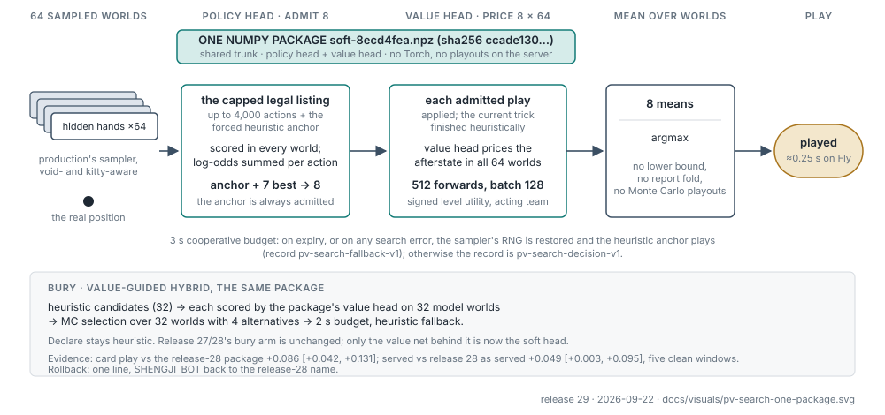

# AI policy ledger

Last reconciled: **2026-09-22 (release 29: the policy/value search with the soft head, pv-search W64/K8 + hybrid bury)**. This file defines the current callable-policy
contract and the scientific conclusions that constrain policy work. It is not
a run log or policy registry duplicate.

- Exact policy implementations and names: `server/shengji/ai/registry.py`
- Production selection: `fly.toml`
- Current priorities and review gates: `BACKLOG.md` and `HANDOFF_ACTIVE.md`
- Research architecture and model lineage: `RL_PLAN.md`
- Immutable verdicts, hashes, and reviewer corrections: `HANDOFF_REVIEW.md`
- What each production change actually bought: the ladder table below
- Engine and sampler contracts: `server/tests/` and `incidents/` (ledger archived at `docs_archive/correctness-through-2026-09-22.md`)
- Runtime performance and deployment: `DEPLOY.md` and issue #208 (the speed record is archived at `docs_archive/perf-through-2026-09-22.md`)

Historical detail remains in Git history and `docs_archive/`. Do not append
dated status blocks here.

## Production contract

The current live Fly snapshot is release 30 (2026-09-22 09:13 ET; release 29's recipe, same package and served
name, with the hybrid-bury fix #607 — the bury keeps the heuristic incumbent once instead of refusing the
decision, which had silently fallen back to the heuristic on ~6% of banker burys on the diagnostic capture set — 24 of
400 deals; the production-traffic rate is unmeasured): **the policy/value search with the
soft-action head 8ecd4fea as ONE package** (`soft-8ecd4fea.npz`; the policy head admits 8 of the legal
actions over 64 sampled worlds, the value head prices them, no playouts; value-guided hybrid bury on
the same package). Release 28 (JS-M1 as one package inside the MC shortlist) is the one-line rollback.

The current selection is:

```toml
SHENGJI_BOT = "pv-search-ccade130-w64-k8-r8bc573be-bury-hybrid-4f003f41e23e"
SHENGJI_PV_CKPT = "/data/models/soft-8ecd4fea.npz"
SHENGJI_PV_SHA256 = "ccade130f34ae61def540441ef997e8d41cef9df96f9683406bbba59ae4ccc75"
SHENGJI_PV_WORLDS = "64"
SHENGJI_PV_CANDIDATES = "8"
SHENGJI_PV_CAP = "4000"
SHENGJI_PV_BATCH_SIZE = "128"
SHENGJI_PV_SERVING_BUDGET_SECONDS = "3"
SHENGJI_PV_BURY_ARM = "hybrid"
SHENGJI_PV_BURY_SERVING_BUDGET_SECONDS = "2"
SHENGJI_FAST = "1"
```

(The release-28 keys — `SHENGJI_CWV_SHORTLIST_CKPT`, `SHENGJI_CWV_PRIOR_*`, `SHENGJI_CWV_BURY_*` — stay in
`fly.toml` so that setting `SHENGJI_BOT` back to
`mc-shortlist-0d17fd03-w32-r0d610b62-prior-0d17fd03-bury-hybrid-003c2abe49ff` is the whole rollback.)


The name is derived by the registry from that environment (the package SHA256,
the W64/K8 recipe digest — worlds, candidates, cap 4,000, batch, budget — and the
bury identity); it is never hand-written. `/healthz` reports the policy name and,
under `pv_search`, the package's on-disk SHA256, worlds, candidates, budgets and
bury arm (the `prior` block belongs to the retained release-28 keys, not to the
active decision path). The server source fallback is `mc` when `SHENGJI_BOT` is
absent. Rollbacks, in order of proximity: release 28 (JS-M1 as one package inside
the MC shortlist; one `SHENGJI_BOT` line), release 27 (M1 + separate prior v2),
release 24 (`fd6bb411` + hybrid bury), `mc-s0-report-lcb`. Changing the package,
the world count, the admitted-candidate count, the cap, the sampler or the bury
arm is a new policy and needs fresh evidence. Release records, images and the
exact rollback environments are in `DEPLOY.md`.

The two sections below describe the release-27/28 decision path (the shortlist
with policy-prior admission). They are the rollback's contract, not release 29's.

### Policy prior admission — deployed (releases 27 and 28)

Below 1,000 legal actions the value net ranks every legal action (unchanged
from the original W32 design). Above 1,000, the policy prior runs once per
sampled world on a root clone of that world (never the true hidden hands);
each world's top 256 actions are unioned with production's own anchor
candidates (median pool about 600 of a bound 8,192, roughly 5% of the legal
set), and only that pool is ranked. The final shortlist (incumbent plus four
alternatives) and the MC selection/report stages are unchanged. Every recipe
field is bound in the policy name (`cwv_shortlist.PRIOR_RECIPE_FIELDS`), the
admission trace records union size, anchors and pool size per decision, and
the 300 s total play deadline stays as the backstop.

Evidence (2026-09-15, capped screens; the release 24 recipe is the control):
paired with M1 on ten shared seeds the prior changed outcomes by
`−0.0003 [−0.0017, +0.0012]` (no resolved difference; a paired estimate, not an
equivalence test); on ten fresh windows M1 + prior read
`+0.0073 [−0.0087, +0.0233]` (MDE80 0.023) with 0 decisions over 60 s and 0 cap
hits in 365,414 (release 24 recipe on the same deals: 161 and 7) at 0.79× its
decision wall; threshold 1,000 versus 10,000 read `−0.0006 [−0.0026, +0.0014]`
paired (no resolved difference) at 0.72× that arm's wall with no decision over
9.9 s in those five windows. Twenty fresh windows of the M1 family pooled `+0.0140 [+0.0026, +0.0254]`
against release 24.

### The soft head in the policy/value search (release 29)



`8ecd4fea`: gen-3-warm's recipe (JS-M1 warm-started on the 256k afterstate corpus, residual trunk,
outcome + search-mean + points heads) with the SEARCH'S PER-CANDIDATE VALUES as the policy target
(soft targets, T=1.0, w=1.0) instead of the played action. Served as one NumPy package
(`soft-8ecd4fea.npz`, sha256 ccade130…) that is both the admission policy and the value evaluator of
the W64/K8 search (`train/pv_search_policy.py`). Evidence, in the order it was gathered: the head alone
beats SmartBot under public information (+0.052 [+0.039, +0.067]); as the whole search it beats
MC-LCB at W16, W32 and W64 in the ladder (W64/K8 +0.187 [+0.144, +0.231]; W4 loses); vs the release-28 package in card play
+0.086 [+0.042, +0.131] on 800 matched deals and +0.122 [+0.079, +0.164] on fresh deals; more worlds
beyond 64 not shown to help (W128−W64 +0.024 [−0.034, +0.083], W256−W64 +0.024 [−0.033, +0.081]);
no head in the W64 family (JS-M1, JS-G1, gen-4 run 1, gen-3-warm) shown superior to it or to each
other; served with hybrid bury vs release 28 as served (five clean windows, 300 s cap) +0.049
[+0.003, +0.095] — clear of zero narrowly, I² 49%. Released 2026-09-22 on that read. Standing caveat: the
served contrast is a summary-level read against the screen's common MC-LCB opponents, not deal-paired
inference, and its lower bound is near zero.

### JS-M1 — the joint model (release 28)


`a5248cc5`: M1's recipe (residual d4 trunk, 176k afterstate corpus, outcome +
search-mean + points heads) trained from scratch for 20 epochs with a 54-card
policy head at weight 0.2, one root batch per value batch streamed from the
full root-row cache (20.3M mover-encoded root decisions on the 140,800 fit
deals). Offline: val CE 0.5957 (M1 0.5975), regret@4 0.0306, holdouts at or
better than M1; policy head on the 15,517 common test-deal rows: listwise CE
0.858 (prior v3 0.975), top-64 recall non-inferior to the separate prior on
four of five strata and better on the two wide partial strata (the 10k+
stratum, 67 deals, is unresolved). In play as one net (five capped windows,
seeds 13260910..13660910): `+0.0239 [+0.0005, +0.0472]` vs the release 24
recipe (nominal, shared-control seeds), paired `+0.0057 [−0.0163, +0.0277]` vs
release 27 at the same decision wall (no resolved difference, not an
equivalence result), 0 decisions over 60 s in those windows. Served as one
NumPy package (schema v2 with the policy head, `server/shengji/ai/cwv_numpy.py`);
the prior admission loads the same file as kind `joint-numpy`. The earlier
joint attempts continued from M1 on 1.0M root rows (J1 weight 1, J2 weight 0.2,
J3 stop-gradient) all trailed the separate prior offline; the from-scratch run
on all root rows closed that gap. Extension to ten windows and fresh seeds are
still owed; JS-G1 (the grid trunk on the same data) and a JS-M1-teacher corpus
(Perf, runJS1) are in progress.

### Serving qualification — every deploy

1. Decision-identity gate (`server/scripts/cwv_serving_gate.py --serving
   --threshold 1000`): the NumPy packages must reproduce the Torch checkpoints'
   decisions (action, RNG state, shortlist and means, admission trace) on 60
   rounds at the serving recipe with the prior exercised; near-tie reorders
   with the same play are reported separately, never folded into "identical".
2. Server-path smoke (`server/scripts/cwv_serving_smoke.py`): build the bot
   from the fly.toml environment exactly as the server does and play bury and
   play turns through `_paced_bot_step` / `_commit_bot_turn`. Release 25 passed
   the gate and stalled every live bot turn because nothing took this path; it
   now precedes every deploy.
3. Packages SHA256-verified on the volume; `/healthz`; a live room's log showing
   a bot bury and bot plays completing.

### Hybrid bury integration — deployed

PR [#323](https://github.com/jerryyyu/shengji/pull/323) merged at `ec7f27ad`.
The deployed policy is
`mc-shortlist-fd6bb411-w32-r55d379a3-bury-hybrid-c93a9877ae6a`, using unchanged
compact package `fd6bb411` / source `3cd27716`, a 2-second cooperative deadline,
and heuristic fallback. Those deadline/fallback semantics are serving policy;
the research recipe had no deadline or fallback. In 1,976 fixed deals, hybrid
versus heuristic measured `+0.03644` utility `[+0.01164,+0.06024]` and `+1.62`
pp win rate `[+0.56,+2.68]`; hybrid versus MC-only was unresolved. Kitty bonus
at least 80 occurred 4 times for hybrid versus 0 for heuristic, so the average
gain does not remove tail-risk. See the [final bury report](docs_archive/value-guided-bury-dev-2026-09-08.md).

### `mc-s0-report-lcb`

The former live champion, now the rollback/reference policy, uses two independent search stages:

1. the complete `mc-strong` N=30 ballot/search nominates one challenger to the
   heuristic incumbent; and
2. the fixed pair is compared on R=300 fresh shared hidden worlds.

The challenger replaces the incumbent only when the one-sided paired lower
confidence bound is at least the zero threshold (equality is accepted). Short
or invalid report folds fail back to the incumbent. The fresh 2,048-cluster
confirmation measured
`+0.338379 +/- 0.067706` signed levels against `mc-strong`; its collision-free
matched extra-work null was `-0.019043 +/- 0.068270`. This establishes the
registered one-round policy—not arbitrary extra search—as the only confirmed
and deployed strength gain.

## The ladder: every production change and what it measured

One row per production change, each measured **against the policy it replaced**, on that era's
instrument. The numbers are signed levels per round unless the row says otherwise. They are NOT
additive and NOT on one scale: the opponents, deal populations, designs and budgets differ by era,
so this is a chain of relative reads, not a cumulative total. Five of the eight changes measured a
resolved gain; three shipped for cost, maintainability or correctness with no strength claim.

| # | change | what it replaced | measured effect | instrument | reading |
|---:|---|---|---|---|---|
| 1 | **MC-LCB report rule** (`mc-s0-report-lcb`) | `mc-strong` N=30 argmax | **+0.338 ± 0.068** | 2,048 fresh clusters | The one-round nominate-then-confirm rule, not extra search: the matched extra-work null was −0.019 ± 0.068. |
| 2 | **W32/K4 shortlist** (release 22) | MC-LCB alone | **+0.139 [+0.065, +0.217]** | 256 rank-2 deals, paired | The first learned win: the value net chose what deserved search, the search still decided. 3.53× wall, engineered to 2.849× bit-identically. |
| 3 | **Hybrid bury** (release 22) | heuristic bury | **+0.036 [+0.012, +0.060]** utility | 1,976 fixed deals | Model-scored heuristic candidates, MC selection. The trial was the RESEARCH recipe, with no deadline and no fallback; the deployed arm adds a 2 s cooperative budget and heuristic fallback, and that serving modification was not what this number measured. Versus MC-only bury it was unresolved. Kitty-bonus tail risk is not removed. |
| 4 | **M1 value net** | the release-24 shortlist package (the standing capped control) | **+0.021 [+0.004, +0.039]** | ten 520-cluster windows on deals no other arm used | The one confirmed model gain of the shortlist era (MDE80 0.025). Width, depth and the last data doubling inside the shortlist bought nothing in play. |
| 5 | **Policy prior v2** (release 27) | hand-written prior | −0.0003 [−0.0017, +0.0012] | paired vs M1 | No resolved difference. Shipped to bound the wide tail above 1,000 legal actions, not for strength. |
| 6 | **JS-M1 as one package** (release 28) | M1 + separate prior | +0.006 [−0.016, +0.028] | paired vs release 27 | No resolved difference, and not an equivalence result. Shipped as cost and maintainability: one file is both prior and value net. |
| 7 | **Policy/value search, soft head** (release 29) | the release-28 package | **+0.086 [+0.042, +0.131]** card play; **+0.049 [+0.003, +0.095]** as served | 800 matched deals, one pre-registered primary; five clean 520-cluster windows | The head IS the search: its policy admits 8 of the legal actions over 64 sampled worlds, its value head prices them, no playouts. Versus MC-LCB in the ladder +0.187 [+0.144, +0.231]. The served read is a common-opponent summary-level estimate, not paired served-vs-served inference, and its lower bound is near zero. |
| 8 | **Hybrid-bury fix** (release 30) | release 29 | not measured | — | Correctness: the bury stopped refusing its own decision and silently falling back to the heuristic on ~6% of banker burys on the diagnostic capture set (24 of 400; the production-traffic rate is unmeasured). No strength claim. |

**Not taken.** More worlds beyond 64 (W128−W64 +0.024 [−0.034, +0.083], W256−W64 +0.024
[−0.033, +0.081]), K16, bounded PUCT, learned continuations, adaptive allocation, and every
warm-started generation as a shortlist package (v33 −0.007 [−0.038, +0.024]) all failed to clear
zero against their own parent. Receipts for rows 1–6 are in the condensed shortlist-era section
below and the linked run records; rows 7–8 in `DEPLOY.md`, the scaling page and the search atlas.

## Callable policy families

`server/shengji/ai/registry.py` is authoritative when this summary and source
ever differ.

| family | intended use | current status |
|---|---|---|
| `heuristic` | Stateless legal baseline and stable Elo anchor. | Supported baseline, not production. |
| `smart`, `smart-v1`, `smart-v2` | Public-memory heuristics: card counting, boss/void inference, point flow, safe throws, ruff risk, bury and endgame rules. | Supported baselines and rollout policies. Exact lineage stays source-bound. |
| `mc`, `mc-lite`, `mc-strong`, `mc-vstrong` | Determinized Monte Carlo at named work levels. `mc` is the source fallback; `mc-strong` is N=30 and a historical rollback. Current rollback boundaries are above. | Supported. A legal sampler is not a calibrated belief model. |
| `mc-s0-*`, nulls, prefix policies | Frozen search/report experiments and matched controls. | Experiment/reproduction only unless `fly.toml` names one. |
| structured-bury, exact-endgame, point-banking, pair/throw and ballot variants | Mechanism-specific experimental constructors. Some intentionally remain outside the global registry to preserve evidence identity. | No production authority. |
| learned checkpoint policies (`rl`, V11, teacher, Direct-Q and successors) | Offline diagnostics, bounded proposals/rankers, or explicitly reviewed experiments. | Lazy/opt-in only, except the exact W32 package named in the production contract above. |
| `mc-cwv-<ckpt8>-w<W>`, `mc-cwv-prior-<ckpt8>-w<W>` | One-ply search whose ENTIRE evaluator is the complete-world value net (`ai/cwv_policy.py`): production's ballot and sampler, W sampled worlds, every (candidate, world) afterstate scored in one batch, argmax of the mean. The `prior` twin is the no-learning control (same positions, the training receipt's stratified prior as the value, in the prior's own utility scale -- PT0 integer levels for the training build's `baselines` prior, with exact terminals converted to match). Registered by `register_cwv_policies` or `SHENGJI_CWV_CKPT`; the checkpoint id is part of the name and a checkpoint whose encoder identity differs from `value_afterstate`'s is refused. | Dev screen only (`scripts/cwv_duel.py`, budget ladder 1x/3x/10x of production's wall). No strength claim; no production authority. |
| `mc-s0-report-lcb-x3`, `-x10` | Production with its selection and report doses scaled together (N=90/R=900, N=300/R=3000): production's own compute curve, the bar a learned arm must beat at each budget. | Reference arms for the ladder only. |
| `mc-shortlist-<ckpt8>-w<W>` (`CWVShortlistBot`; DEV) | Exhaustive legal actions ranked by the complete-world model over W sampled worlds; K4 or K8 alternatives plus incumbent go to full N30/R300 MC. Unlike `mc-cwv-*`, the model does not replace the final rollout evaluator. Registered by `register_cwv_shortlist_policies` or `SHENGJI_CWV_SHORTLIST_CKPT` so `make_bot` (and `harvest/trajectory.py --policy`) can reach it; the entry point REFUSES to hand back anything that is not a `CWVShortlistBot`, because `mc-cwv-<ckpt8>-w32` is the one-ply bot, not this one. | W32 PLAY and hybrid BURY are live in release 22, with bounded heuristic fallback. See below. |

Example local selection:

```bash
SHENGJI_BOT=smart uv run shengji-server
```

Programmatic construction should always pass a deterministic policy seed:

```python
from shengji.ai.registry import make_bot

bot = make_bot("mc-strong", seed=1234)
```

## The shortlist era, condensed (releases 22–28)

**Design.** The model chose which moves deserved expensive search; the search decided. The
value net ranked the exhaustive legal set over 32 constrained sampled worlds; four alternatives
plus the heuristic incumbent went to production's N30/R300 Monte Carlo search with heuristic
rollouts and the paired-LCB report rule. From release 27 a policy prior pruned positions above
1,000 legal actions to the union of per-world top-256; from release 28 one joint package
(JS-M1) was both the prior and the value net. Hybrid bury (heuristic candidates, model-scored,
MC selection, 2 s budget) shipped with release 22 and is unchanged in release 29.

**What it measured** (signed levels per round, 95% paired-deal intervals):

| result | value | reading |
|---|---:|---|
| W32/K4 vs production N30/R300, 256 rank-2 deals | **+0.139 [+0.065, +0.217]** | the first learned win; 3.53× wall after decision-preserving engineering (2.849×, bit-identical) |
| K8 − K4, same deals | −0.057 [−0.113, −0.004] | keep K4 |
| W64 − W32; N60/R600 − N30/R300 | −0.043; −0.018, both crossing zero | more worlds or rollouts did not add |
| 13-rank check, 260 deals | +0.062 [−0.006, +0.135] | inconclusive across ranks |
| adaptive allocation; one extra guided trick; double shortlist; points leaf | all cross zero | depth and allocation inside the shortlist did not add |
| M1 (two heads, d4) on fresh deals | +0.021 [+0.004, +0.039] | the one confirmed model gain of the era |
| prior v2 paired vs M1; JS-M1 paired vs M1 + prior | −0.0003; +0.006, both null | releases 27 and 28 were cost and maintainability, not strength |
| warm generations 1–4 as packages | null (v33: −0.007 [−0.038, +0.024]) | 54–62% of deals tie: the instrument cannot resolve small heads |

Original readouts: `server/runs/cwv_full_legal_shortlist_dev_20260905.md` and the linked run
records; scaling page rows 22–38; atlas rows 6–38. No number here is a current production claim.

## Search and heuristic behavior that survives

These are governing conclusions, not an invitation to reproduce old toggle
grids in this document.

- N=30 Monte Carlo clearly improved on the smaller base search. Uniform N=60
  did not establish another gain.
- The conservative disjoint R=300 report fold is the confirmed improvement.
  Alternative confidence and adaptive-allocation recipes did not establish an
  additional winner.
- The heuristic incumbent must remain candidate zero. Tractor-lock,
  point-shy near-tie handling, deterministic ballot order, and exact work
  counters are policy identity.
- Public memory may use declarations, plays, voids, remaining-pair/run bounds,
  actor-private hand, and banker-private burial where applicable. It may not
  read other hidden hands or a non-banker burial.
- Safe-shuai, boss/pair/tractor, point-flow, ruff-risk, void-building, and
  endgame heuristics are useful parents and diagnostics. Their presence is not
  evidence that every fallback is strong; production-policy quality gaps must
  be replayed and attributed to legality, ballot, world sampling,
  continuation, or value before patching.

The old exhaustive toggle table is preserved in Git history. Source owns what
is currently enabled; old head-to-head rates are screening evidence, not
production claims.

## Scaling and search insights (through 2026-09-22)

The scaling page (`docs/scaling_log/`) and the search atlas carry every run and screen with its
receipt. The durable conclusions:

**Models.** Offline cross-entropy does not order play (the programme's best CE played like the
leader); the last full data doubling inside the shortlist bought −0.0036 CE and nothing in play;
width and depth alone did not move play; encoder v2 was the one real gain and v3–v5 bought
nothing; warm-started generations were null as packages; the policy head alone is SmartBot-level
under public information; the soft target (the search's own values as the policy target) is the
ingredient with the largest point estimate in the head-driven search, with no head in the W64
family shown superior to another; corpus seeds are decks and are excluded from screens per model.

**Search.** Worlds were the lever through 64 and the ladder shows no resolved gain beyond
(W128−W64 +0.024 [−0.034, +0.083], W256−W64 +0.024 [−0.033, +0.081]; unresolved, not equivalence);
K8 not K16; the value head replaces playouts outright (W64/K8 +0.187 vs MC-LCB in the ladder, +0.086 vs the
release-28 package in card play); a T1 value cutoff beats terminal-level MC while learned
continuations and bounded PUCT lose or add nothing at large cost multiples; the served read
(+0.049, a common-opponent summary-level estimate, not paired served-vs-served inference) is
smaller than the card-play read (+0.086, different deals and design), with no measured cause;
the deploy gate is the served design.

## Current scientific conclusions

| lane | conclusion for policy work |
|---|---|
| **RLCB** | The confirmed MC-LCB search; the historical screen baseline through 2026-09-21 (from 2026-09-22 every new search comparison is against production W64/K8, Jerry's direction on #436). Superseded in production by the model-guided shortlist (W32, then M1 + prior, then the JS-M1 joint model), and from release 29 by the head-driven policy/value search, which uses no MC playouts in play. |
| **Head-driven policy/value search (release 29, 2026-09)** | The soft head as the whole search beats MC-LCB at W16, W32 and W64 in the ladder (W4 loses), the release-28 package in card play (+0.086 [+0.042, +0.131]) and release 28 as served (+0.049 [+0.003, +0.095], narrow; a common-opponent summary-level read, not paired inference). No resolved gain beyond 64 worlds in the ladder; no head in the W64 family shown superior; the next production claim needs a served contrast against release 29. |
| **M1 / policy prior v2 / JS-M1 (2026-09)** | M1 confirmed on fresh deals (+0.0212 [+0.0036, +0.0387]); the prior's paired contrast with M1 is −0.0003 [−0.0017, +0.0012] (no resolved difference) with 0 decisions >60 s in the 365k observed; JS-M1 as one net reads +0.0057 [−0.0163, +0.0277] paired vs the two-model arm (no resolved difference, not established non-inferiority) and +0.0239 [+0.0005, +0.0472] vs release 24 at five (nominal). Deployed as release 28; ten-window and fresh-seed reads owed. |
| **Global learned rankers / V11 / Direct-Q / teacher direct play** | Better label fit or isolated proposal signal did not transport into a stronger whole-game policy. Keep learned scores bounded to their reviewed role. |
| **S4 point banking, S6 shuai sourcing, pair-aware continuations** | Mechanisms were plausible or locally positive but no registered whole-game successor cleared the required bar. Do not revive them as unchanged retries. |
| **T4 model proposal** | Selected none. The uninformed widening control was positive against champion but used 14.8% more accepted worlds and 80.9% more searches; it requires a three-arm compute/candidate attribution test. |
| **BELIEF R4/R5** | R4's preserved synthetic-primary cohort reduced held-out count Brier by 21.40% versus REF-C, but the permuted-label control also improved materially and failed on demand — a predictive channel, not behavioral belief learning. The opened-DEV consumer diagnostic then sealed `NO_PRIMARY_POLICY_SIGNAL` (ESS 97–99.5% of maximum, 1/104 flips, paired value exactly zero). R4 is terminal; no R5 compute proceeds unless a separate oracle-belief probe shows a gain worth reopening. No BELIEF sampler, candidate, or policy is registered or deployable. |
| **PT0** | Privileged late-endgame policy had a small edge over heuristic/smart and an inconclusive edge over production MC. |
| **PT1** | Clean negative despite high action-flip dose: exact teacher guidance did not produce the required utility improvement. |
| **PT-Full** | A single true-world collapse was bad; repeated true-world search recovered most of that loss but did not beat the public ensemble. |
| **C0** | Fixed perfect-information consumer variants all lost to both required parents; local bare-point symptom fixes did not transport. |
| **K8 shortlist** | Exploratory DEV screen: +0.08203 versus production (95% CI `[+0.00972,+0.15430]`), but −0.05664 directly versus K4 (95% CI `[-0.11328,-0.00391]`; 17 favorable / 32 unfavorable / 207 tied). Keep K4; no K16 escalation or deployment. |
| **Value-Afterstate V0** | `REFUSE_MECHANICS_OR_NEGATIVE_CONTROL` (2026-08-28, source `d9ad99f6`, independently verified): the first afterstate value screen refused on its own mechanics/negative-control gates; no value signal was established. |
| **Value-Afterstate V1 P1** | `SELECT_NONE_NO_ACTION_ADVANTAGE` (2026-08-29, reproduced exactly): the natural arm was the worst of four, beaten by two of its own negative controls. A clean learning null that motivated the V2 absolute-leaf redesign. |
| **PT-Sol0 / PT-Luna0** | First reviewed flexible-planner milestone. On the same 26 full-round roots and 52 mirrored treatment roles, Sol beat exact production arm A by `+17/26` signed levels per role and Luna by `+5/13`; both also beat B and C0-S on average. Luna was `-7/26` versus Sol, so Sol remains the quality teacher while Luna is the cheaper scaling candidate. This is open-DEV privileged-information mechanism evidence—not a registered policy, fresh strength result, or deployment authority. |
| **PT-Luna isolated (b0b1bd95)** | First COMPLETE terminal of the teacher lane (ledger `6c71bee3`): 32/32 games, 16/16 clusters, 0 failed, 21,979,625 tokens, independently reconstructed. Readable only for the scoped teacher/value research; label ingestion and training are separate gates. Four predecessor routes (30 games, 24,749,862 tokens) are engineering-only. Its planned use is diagnostic (where the flexible planner beats production, by mechanism) and as a fine-tuning/evaluation value target — not action imitation. |
| **PT-Luna batch4 versus compact1 (completed #280)** | 52 deals / 104 mirrored rounds: batch4−compact1 −0.1058 levels/round [−0.2885,+0.0769], with 2.27× fewer reported tokens/decision and 1.70× serial provider throughput. Equal quality is not established; seven shared-response waves limit the deal-bootstrap interval. Neither play-only arm is the historical rollout-enabled teacher or production MC. Retained native exports: 3,900 fit + 3,852 validation records, disjoint deals and losses preserved. Opened validation is not fitting data or fresh confirmation. [Readout](server/runs/luna_quality_gameplay_tranche1_result_20260906.md). |
| **Value V2 D64 (2026-09)** | Sealed `D64_DEV_SEALED` at exact source `11c43839` after 12 training epochs. On 12 natural audit deals, outcome-distribution RPS improved by `+0.006400834` (90% deal-bootstrap interval `[+0.002789151,+0.010361512]`; 4/4 members positive), but expected-value absolute error worsened by `-0.178319` signed levels (`[-0.306394,-0.037274]`) and paired action-sensitivity error worsened by `-0.045395` (`[-0.058033,-0.032902]`). Selected-action utility was inconclusive at `+0.0625` (`[-0.21875,+0.375]`) with 91.7% action-change dose and worst-decile utility `-0.8125`. This is small-DEV evidence of distribution-shape learning without calibrated scalar/action value, not a usable consumer or strength result. The frozen 256-slot ledger and 255 realized shards are coverage-audit evidence only; no missing-slot completion or slot-targeted D256 training follows. |

## Retired BELIEF policy boundary

BELIEF R4/R5 is closed (2026-08-31): the offline Brier gain did not survive its permuted-label
control and the DEV consumer showed no policy signal. The retained contract for any separately
justified re-entry: training may use true hidden hands as separately sealed privileged labels;
runtime input is only what the acting seat can see; hidden-world twins with identical actor
observations must produce identical runtime input; deductions and behavioral probabilities stay
distinct; per-card marginals must be projected into legal, correlated complete worlds before
search consumes them; the search remains final action authority. An offline calibration result
never authorizes a policy or a deployment. Design set and artifact inventory:
`docs_archive/BELIEF_V1_*.md`, `docs_archive/rl-plan-through-2026-08-15.md`, issue #217.

## Evaluation and identity rules

Every decision-bearing policy comparison binds:

1. exact source, policy names/classes, engine/native mode, and runtime;
2. ballot and incumbent identity;
3. sampler, continuation, objective, perspective, and deterministic seeds;
4. selection/report budgets and exact accepted-work counters;
5. mirrored roles/deals and the round/deal cluster as the uncertainty unit;
6. immutable population, split, artifact schemas, and terminal rule; and
7. a behavior/work-matched null that differs only on the proposed mechanism.

Elo pools, human agreement, individual decisions, offline loss, state regret,
and open-DEV screens prioritize hypotheses. Strength requires a fresh mirrored
whole-game comparison against the exact live champion, followed by confirmation
when the design calls for it.

## Correctness and runtime boundaries

- Tied effective cards retain physical identity; throws may be ruffed; failed
  throws force the engine-selected component; pair and follow obligations are
  engine facts, not heuristic preferences.
- The current sampler consumes public declarations, voids, remaining-pair/run
  bounds, hand sizes, and actor-known burial once. Strict validity/support on
  named reservoirs does not prove posterior calibration or globally complete
  constructive dealing.
- Banker declaration pins must allow a declared card to be in the hidden
  burial when the rules permit it. Public failed-throw content is limited to
  what the engine actually broadcasts.
- `SHENGJI_FAST=1` routes through reviewed native kernels. Pure/compiled parity
  and bit identity are correctness gates; a speedup is not strength evidence.
- Production does not enable experimental posterior-changing sampler flags.
- Factory seeds must reach every stochastic component; caches use canonical
  keys and defensive copies; short/zero-work evaluations refuse rather than
  silently fall back inside scientific packets.
- Encoder identity includes semantics and transitive source bytes. Assets with
  private-kitty or other actor-visibility drift remain quarantined even when
  their tensor dimensions match.

## Change and deployment rules

- Name the literal parent; “current,” “MC,” and “champion” are not identities.
- Review scientific source/freeze once as one packet. Add another review only
  when the first finds a load-bearing defect or reviewed bytes materially
  change.
- Never use a rehearsal outcome to tune a frozen population, threshold, seed,
  or terminal rule. Rehearsal proves the mechanics path only.
- Correctness fixes, throughput gains, larger corpora, or better training loss
  enable a policy experiment; none counts as an AI win.
- No result may implicitly authorize merge, promotion, deployment, retry, test
  opening, or a different policy. Those authorities are explicit and separate.
- Release 28 is the immediate rollback for release 29 (one `SHENGJI_BOT` line), release 27 the next;
  `mc-s0-report-lcb` is the deep policy rollback. For runtime regressions use
  the image rollback in `DEPLOY.md`.

## Durable pointers

| topic | source |
|---|---|
| current queue | `BACKLOG.md` |
| active fleet and exact review asks | `HANDOFF_ACTIVE.md` |
| callable code | `server/shengji/ai/registry.py` |
| production config | `fly.toml` |
| model/belief/teacher design | `RL_PLAN.md` |
| immutable evidence and review corrections | `HANDOFF_REVIEW.md` |
| engine/sampler contract | `server/tests/`, `incidents/` (archived ledger `docs_archive/correctness-through-2026-09-22.md`) |
| performance and deployment | `DEPLOY.md`, issue #208 (archived record `docs_archive/perf-through-2026-09-22.md`) |
| old policy/toggle ledger | Git history and `docs_archive/` |
