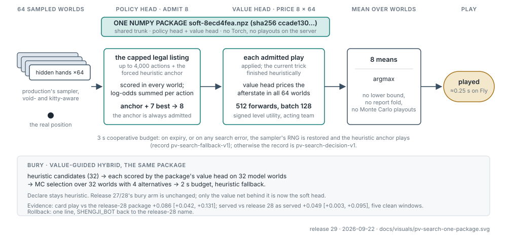
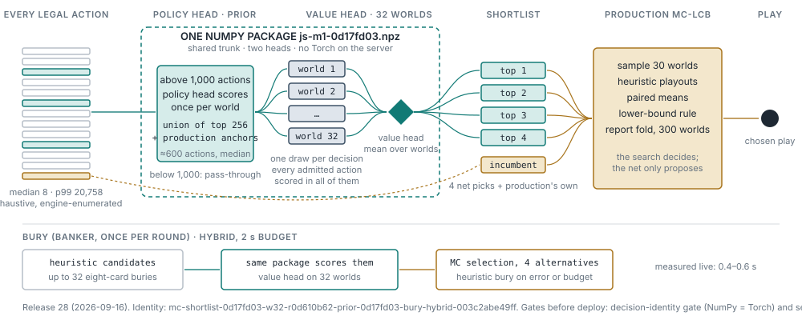

# AI policy ledger

Last reconciled: **2026-10-03**.

**Production is release 38**, live since 2026-10-03 09:41 ET: release 36's package (the gen-5 SMV3 outcome head) in
the release-30 pv-search W64/K8 + hybrid bury, plus four search rules. **Every new screen compares against release
38 as served** (Jerry, 2026-10-03); screens already read against release 36 or the combo keep their declared
comparator.

This file holds the callable-policy contract and the scientific conclusions that constrain policy work. It is not a
run log or a copy of the registry. Other sources are under [Durable pointers](#durable-pointers). History lives in
Git and `docs_archive/`; do not append dated status blocks here.

## Production contract

**Release 38** (deployed 2026-10-03 09:41 ET; Jerry approved promotion and the deploy 2026-10-03; #698 at main
`c8d487a6`; image `deployment-01M40ZWSAHNX4782CGKJ615YF7`). It keeps release 36's package, search, bury and budgets:
the policy head admits 8 of the legal actions over 64 sampled worlds, the value head prices them, no playouts;
value-guided hybrid bury on the same package; budgets 3 s / 2 s; the JS-M1 prior keys retained. It adds four search
rules, off by default in source and on in release 38:

- **Admission diversity `div`** (#680): at most 2 admitted actions per structural key; near-duplicates sharing all
  but one card are skipped; back-fill when short.
- **Refusal-constraint sampling `rc`** (#689): sampled worlds must make this round's refused throws refusable with
  the same forced component.
- **Tie-break by points `tb`** (#682): among candidates within 0.02 level of the best mean, the most root-team points
  from the current trick under the search's own trick finisher.
- **Lead-anchor `la`** (#694): on a lead whose heuristic anchor is a non-trump single that is not the top live card,
  slot 0 becomes the highest plain pair/tractor, else the policy's top action.

Without the rules (releases 36 and 37) slot 0 was always the heuristic play, the seven best-scored actions were
admitted unfiltered, and the highest mean played. Play has a 3 s cooperative budget; on expiry the bot plays the
heuristic anchor.

Evidence: ladder row 10 (#676). Further detail: the combination's first ten windows read +0.0175
[−0.0020, +0.0370]; the lead-anchor-alone read is issuecomment-5963796858; play latency on the same 808 states was
p50 0.119 s vs release 36's 0.107 s.

The selection (gate and rollback environments are in `DEPLOY.md`):

```toml
SHENGJI_BOT = "pv-search-491ee4bf-w64-k8-div-rc-tb-la-r7092480e-bury-hybrid-5517ddbd7457"
SHENGJI_PV_CKPT = "/data/models/smv3out-491ee4bf.npz"
SHENGJI_PV_SHA256 = "491ee4bf81abe783d14f1e004d31ceda1ff2679bd2e14b60a5a9fa96b57c2670"
SHENGJI_PV_WORLDS = "64"
SHENGJI_PV_CANDIDATES = "8"
SHENGJI_PV_CAP = "4000"
SHENGJI_PV_BATCH_SIZE = "128"
SHENGJI_PV_SERVING_BUDGET_SECONDS = "3"
SHENGJI_PV_BURY_ARM = "hybrid"
SHENGJI_PV_BURY_SERVING_BUDGET_SECONDS = "2"
SHENGJI_PV_ADMISSION_DIVERSITY = "1"
SHENGJI_PV_REFUSAL_CONSTRAINTS = "1"
SHENGJI_PV_TIEBREAK_POINTS = "1"
SHENGJI_PV_LEAD_ANCHOR = "1"
SHENGJI_FAST = "1"
```

The registry derives the name from that environment (package SHA256; the W64/K8 recipe digest of worlds,
candidates, cap 4,000, batch and budget; bury identity). It is never hand-written. `/healthz` reports the name and,
under `pv_search`, the package's on-disk SHA256, worlds, candidates, budgets and bury arm. Its `prior` block belongs
to the retained release-28 keys, not the active decision path. Without `SHENGJI_BOT` the server falls back to `mc`.
Changing the package, world count, admitted-candidate count, cap, sampler or bury arm makes a new policy and needs
fresh evidence.

**Earlier releases and rollbacks, nearest first.** Release records, images and exact environments are in
`DEPLOY.md`; for runtime regressions use its image rollback.

1. **Release 37** (2026-10-01 01:1x ET, #671): a phone-HUD CSS fix on release 36's bot; NO model, package or
   serving change. Rolling back release 38 to its image `deployment-01M3TXZ85YHJM108TBPWKN8BB2` is one option.
2. **Release 36** (2026-09-30 11:53 ET, #666): the first model change since release 30, **the gen-5 SMV3 checkpoint
   3e89e86f's OUTCOME head as ONE package** (`smv3out-491ee4bf.npz`; arm F's recipe plus the search-mean sidecar
   v3, #658) inside release 30's search unchanged. Evidence: ladder row 9. Rollback of release 38: delete the four
   `SHENGJI_PV_*` rule lines, restore the release-36 `SHENGJI_BOT` kept as a comment in `fly.toml`, then
   `fly deploy --ha=false`.
3. **Releases 29–35** served the soft head 8ecd4fea (`soft-8ecd4fea.npz`, sha ccade130…); release 30 (2026-09-22
   09:13 ET) added the hybrid-bury fix #607. Release 30 is the immediate rollback for releases 36/37: the three
   release-30 lines kept as a comment in `fly.toml` (the package stays on the volume) and `fly deploy --ha=false`,
   or the release-35 image.
4. **Release 28**: JS-M1 as one package inside the MC shortlist. Its keys (`SHENGJI_CWV_SHORTLIST_CKPT`,
   `SHENGJI_CWV_PRIOR_*`, `SHENGJI_CWV_BURY_*`) stay in `fly.toml`, so setting `SHENGJI_BOT` back to
   `mc-shortlist-0d17fd03-w32-r0d610b62-prior-0d17fd03-bury-hybrid-003c2abe49ff` is the whole rollback.
5. **Release 27**: M1 + separate prior v2.
6. **Release 24**: `fd6bb411` + hybrid bury.
7. `mc-s0-report-lcb`: the deep policy rollback.

The subsections below are records of earlier decision paths, kept because they are the rollback contracts and
because parts of them are still served. Policy prior admission and JS-M1 describe the release-27/28 shortlist path
(the release-28 rollback's contract). The soft head describes release 29's package, which releases 29–35 served.
Serving qualification and hybrid bury still apply to release 38. `mc-s0-report-lcb` is the deep rollback.

### Policy prior admission — deployed (releases 27 and 28)

Below 1,000 legal actions the value net ranks every legal action, as in the original W32 design. Above 1,000:

- the policy prior runs once per sampled world, on a root clone of that world (never the true hidden hands);
- each world's top 256 actions are unioned with production's own anchor candidates (median pool about 600 of a
  bound 8,192, roughly 5% of the legal set);
- only that pool is ranked.

The final shortlist (incumbent plus four alternatives) and the MC selection/report stages are unchanged. The
policy name binds every recipe field (`cwv_shortlist.PRIOR_RECIPE_FIELDS`); the admission trace records union size,
anchors and pool size per decision; the 300 s total play deadline is the backstop.

Evidence (2026-09-15, capped screens; the release 24 recipe is the control):

- Prior vs M1, paired on ten shared seeds: `−0.0003 [−0.0017, +0.0012]`. No resolved difference; a paired estimate,
  not an equivalence test.
- M1 + prior on ten fresh windows: `+0.0073 [−0.0087, +0.0233]` (MDE80 0.023), at 0.79× the release 24 recipe's
  decision wall. 0 decisions over 60 s and 0 cap hits in 365,414 (release 24 recipe on the same deals: 161 and 7).
- Threshold 1,000 vs 10,000, paired: `−0.0006 [−0.0026, +0.0014]` (no resolved difference), at 0.72× that arm's
  wall, with no decision over 9.9 s in those five windows.
- Twenty fresh windows of the M1 family, pooled against release 24: `+0.0140 [+0.0026, +0.0254]`.

### The soft head in the policy/value search (release 29)



`8ecd4fea` is gen-3-warm's recipe (JS-M1 warm-started on the 256k afterstate corpus, residual trunk, outcome +
search-mean + points heads), but its policy target is the SEARCH'S PER-CANDIDATE VALUES (soft targets, T=1.0,
w=1.0), not the played action. One NumPy package (`soft-8ecd4fea.npz`, sha256 ccade130…) is both the admission
policy and the value evaluator of the W64/K8 search (`train/pv_search_policy.py`).

Evidence, in the order it was gathered (ladder row 7 has the caveats):

- Head alone vs SmartBot under public information: +0.052 [+0.039, +0.067].
- Whole search vs MC-LCB in the ladder: wins at W16, W32 and W64 (W64/K8 +0.187 [+0.144, +0.231]); W4 loses.
- Vs the release-28 package in card play: +0.086 [+0.042, +0.131] on 800 matched deals; +0.122 [+0.079, +0.164] on
  fresh deals.
- More worlds beyond 64 not shown to help (see "Not taken" under the ladder).
- No head in the W64 family (JS-M1, JS-G1, gen-4 run 1, gen-3-warm) shown superior to it or to each other.
- Served with hybrid bury vs release 28 as served (five clean windows, 300 s cap): +0.049 [+0.003, +0.095], clear of
  zero narrowly; I² 49%. Released 2026-09-22 on that read.

### JS-M1 — the joint model (release 28)



`a5248cc5` is M1's recipe (residual d4 trunk, 176k afterstate corpus, outcome + search-mean + points heads) trained
from scratch for 20 epochs, with a 54-card policy head at weight 0.2 and one root batch per value batch from the full
root-row cache (20.3M mover-encoded root decisions on the 140,800 fit deals).

- Offline: val CE 0.5957 (M1 0.5975), regret@4 0.0306, holdouts at or better than M1.
- Policy head on the 15,517 common test-deal rows: listwise CE 0.858 (prior v3 0.975). Top-64 recall is
  non-inferior to the separate prior on four of five strata and better on the two wide partial strata; the 10k+
  stratum (67 deals) is unresolved.
- In play as one net (five capped windows, seeds 13260910..13660910): `+0.0239 [+0.0005, +0.0472]` vs the release
  24 recipe (nominal, shared-control seeds); paired `+0.0057 [−0.0163, +0.0277]` vs release 27 at the same decision
  wall (no resolved difference, not an equivalence result); 0 decisions over 60 s in those windows.

Served as one NumPy package (schema v2 with the policy head, `server/shengji/ai/cwv_numpy.py`); the prior admission
loads the same file as kind `joint-numpy`. Earlier joint attempts from M1 on 1.0M root rows (J1 weight 1, J2 weight
0.2, J3 stop-gradient) all trailed the separate prior offline; training from scratch on all root rows closed that
gap.

What was read afterwards (the scaling log, `docs/scaling_log/models.py`, rows JS-M1, JS-G1 and gen-1):

- The owed fresh-seed read (lane v24, 2026-09-17, five fresh windows 16260910..16660910, paired against release 27
  at the same admission threshold): `−0.0159 [−0.0383, +0.0065]`, inconclusive with a negative point. The nominal
  `+0.0239` did not confirm, so release 28 carries no strength claim (ladder row 6). The scaling log records no
  ten-window read of JS-M1.
- JS-G1 (the grid trunk on the same data, sealed 2026-09-16): `+0.0184 [−0.0056, +0.0425]` against the capped
  control on five windows, and `−0.0051 [−0.0286, +0.0184]` paired against JS-M1; both inconclusive, at 1.32× the
  decision wall of M1 + prior at the same threshold. Not promoted.
- The JS-M1-teacher corpus runJS1 completed (16,000 clusters) and went into gen-1, which was inconclusive in play
  (`+0.0136 [−0.0085, +0.0357]`, five windows).

### Serving qualification — every deploy

For the `pv-search` mode (production since release 29; the gate as `DEPLOY.md` records it for releases 29–38):

1. Package on the volume, SHA256-verified. CI also fetches the pinned production package and loads it on the tree
   (`.github/workflows/pr-checks.yml`), and `server/tests/test_bury_fly_config.py` pins the served name that the
   `fly.toml` environment derives.
2. Server-path smoke (`server/scripts/cwv_serving_smoke.py`, which also builds the `pv-search` bot when
   `SHENGJI_PV_CKPT` is set): build the bot from the `fly.toml` environment exactly as the server does and play
   bury and play turns through `_paced_bot_step` / `_commit_bot_turn`, on the merged tree against the exact
   package. Release 25 passed the decision-identity gate yet stalled every live bot turn because nothing took
   this path.
3. For a strength change, the served-bot screen against the current production release.
4. Jerry's go; then `/healthz` (the name and the `pv_search` block) and a live room's log showing a bot bury and
   bot plays completing.

For a shortlist package (releases 22–28, now the rollback path) there is one more step before the smoke: the
decision-identity gate (`server/scripts/cwv_serving_gate.py --serving --threshold 1000`). The NumPy packages must
reproduce the Torch checkpoints' decisions (action, RNG state, shortlist and means, admission trace) on 60 rounds
at the serving recipe, prior exercised. Near-tie reorders with the same play are reported separately, never folded
into "identical". Its serving scope is the W32/N30 shortlist recipe; it last ran for release 28 and `DEPLOY.md`
records no run of it for a `pv-search` release.

### Hybrid bury integration — deployed

PR [#323](https://github.com/jerryyyu/shengji/pull/323) merged at `ec7f27ad`. Historical: it first shipped in the
shortlist era as `mc-shortlist-fd6bb411-w32-r55d379a3-bury-hybrid-c93a9877ae6a`: unchanged compact package
`fd6bb411` / source `3cd27716`, plus a 2-second cooperative deadline and heuristic fallback that the research
recipe did not have. The same bury arm is still served. In release 38 the `pv-search` bot runs it
(`PVSearchBuryBot` in `server/shengji/train/pv_search_policy.py`, which reuses `CWVBuryMixin` from
`cwv_bury_policy.py`) on the production package's value head: `SHENGJI_PV_BURY_ARM = "hybrid"` with the 2-second
budget, the `-bury-hybrid-5517ddbd7457` part of the served name, including the release-30 fix (#607).
Exact numbers behind ladder row 3 (1,976 fixed deals, hybrid vs heuristic): `+0.03644` utility
`[+0.01164,+0.06024]`, `+1.62` pp win rate `[+0.56,+2.68]`. Kitty bonus of at least 80 occurred 4 times for hybrid
vs 0 for heuristic. [Final bury report](docs_archive/value-guided-bury-dev-2026-09-08.md).

### `mc-s0-report-lcb`

The former live champion, now the rollback/reference policy, in two independent search stages:

1. the complete `mc-strong` N=30 ballot/search nominates one challenger to the heuristic incumbent; and
2. the fixed pair is compared on R=300 fresh shared hidden worlds.

The challenger replaces the incumbent only when the one-sided paired lower confidence bound is at least zero
(equality accepted); short or invalid report folds fall back to the incumbent. Exact numbers behind ladder row 1:
`+0.338379 +/- 0.067706` signed levels vs `mc-strong` on 2,048 fresh clusters; collision-free matched extra-work null
`-0.019043 +/- 0.068270`. This establishes the registered one-round policy, not arbitrary extra search, as the source
of that gain. It was the first confirmed and deployed strength gain; ladder rows 2, 3, 4, 7, 9 and 10 record the
later ones.

## The ladder: every production change and what it measured

Each row is measured **against the policy it replaced**, on that era's instrument, in signed levels per round unless
noted. The numbers are NOT additive and NOT on one scale (opponents, deals, designs and budgets differ by era): a
chain of relative reads, not a cumulative total. Seven of the ten changes measured a resolved gain; three shipped for
cost, maintainability or correctness with no strength claim. Row 10's confirmed part is the three-rule combination;
its lead-anchor increment is a small positive read, not a confirmation.

| # | change | what it replaced | measured effect | instrument | reading |
|---:|---|---|---|---|---|
| 1 | **MC-LCB report rule** (`mc-s0-report-lcb`) | `mc-strong` N=30 argmax | **+0.338 ± 0.068** | 2,048 fresh clusters | The one-round nominate-then-confirm rule, not extra search: the matched extra-work null was −0.019 ± 0.068. |
| 2 | **W32/K4 shortlist** (release 22) | MC-LCB alone | **+0.139 [+0.065, +0.217]** | 256 rank-2 deals, paired | The first learned win: the value net chose what deserved search, the search still decided. 3.53× wall, engineered to 2.849× bit-identically. |
| 3 | **Hybrid bury** (release 22) | heuristic bury | **+0.036 [+0.012, +0.060]** utility | 1,976 fixed deals | Model-scored heuristic candidates, MC selection. The trial was the RESEARCH recipe, with no deadline and no fallback; the deployed arm adds a 2 s cooperative budget and heuristic fallback, and that serving modification was not what this number measured. Versus MC-only bury it was unresolved. Kitty-bonus tail risk is not removed. |
| 4 | **M1 value net** | the release-24 shortlist package (the standing capped control) | **+0.021 [+0.004, +0.039]** | ten 520-cluster windows on deals no other arm used | The one confirmed model gain of the shortlist era (MDE80 0.025). Width, depth and the last data doubling inside the shortlist bought nothing in play. |
| 5 | **Policy prior v2** (release 27) | hand-written prior | −0.0003 [−0.0017, +0.0012] | paired vs M1 | No resolved difference. Shipped to bound the wide tail above 1,000 legal actions, not for strength. |
| 6 | **JS-M1 as one package** (release 28) | M1 + separate prior | +0.006 [−0.016, +0.028] | paired vs release 27 | No resolved difference, and not an equivalence result. Shipped as cost and maintainability: one file is both prior and value net. |
| 7 | **Policy/value search, soft head** (release 29) | the release-28 package | **+0.086 [+0.042, +0.131]** card play; **+0.049 [+0.003, +0.095]** as served | 800 matched deals, one pre-registered primary; five clean 520-cluster windows | The head IS the search: its policy admits 8 of the legal actions over 64 sampled worlds, its value head prices them, no playouts. Versus MC-LCB in the ladder +0.187 [+0.144, +0.231]. The served read is a common-opponent summary-level estimate, not paired served-vs-served inference, and its lower bound is near zero. |
| 8 | **Hybrid-bury fix** (release 30) | release 29 | not measured | — | Correctness: the bury stopped refusing its own decision and silently falling back to the heuristic on ~6% of banker burys on the diagnostic capture set (24 of 400; the production-traffic rate is unmeasured). No strength claim. |
| 9 | **SMV3 outcome head** (release 36) | the release-30 package, same search | **+0.0393 [+0.0033, +0.0752]** as served (confirmation v36a2; the first read v36a +0.0361 [+0.0015, +0.0707]) | five 520-cluster windows each, common MC-LCB control, vs release 30 as served | The gen-5 SMV3 checkpoint 3e89e86f's OUTCOME head (arm F's recipe + sidecar v3, #658) in release 30's search unchanged. Confirmed by a predeclared second read; a common-opponent summary-level estimate like row 7. Policy head alone beats the production head +0.21 level/round in paired duels while served head swaps sit within ±0.02: measured decoupling, not a ceiling (#663). |
| 10 | **Search rules div + rc + tb + la** (release 38, deployed 2026-10-03) | release 36/37, same package | **+0.0461 [+0.0242, +0.0681]** (div + rc + tb vs release 36, ten fresh windows: CONFIRMED); +0.0106 [+0.0006, +0.0205] (+ la over that combination, ten windows: POSITIVE incremental) | 520-cluster windows, common MC-LCB control | One confirmed contrast (the three-rule combination, #676 issuecomment-5962364713) and one small positive incremental contrast with a lower bound near zero (lead-anchor on the combination, issuecomment-5965252288), which is not a second confirmation. Indirect reads through the common control, not head-to-head win rates, and not additive. Alone, div, rc and tb were unconfirmed or inconclusive; lead-anchor alone was positive exploratory (+0.0138 [+0.0013, +0.0262], five windows, below the extension triage). Deployed as release 38 on 2026-10-03 09:41 ET; play p50 ≈ +10% latency, zero fallbacks. |

**Gen 5, not taken (2026-09-24 to 09-27).** Five one-variable retrains of the production head, each screened as
served vs release 30 on five fresh 520-cluster mirrored windows (common MC-LCB control, DL random effects, MDE80 ≈
0.05):

| arm | change | vs release 30 |
|---|---|---|
| A | MC-LCB corpora dropped | **−0.061 [−0.096, −0.025]**, resolved and negative |
| B | MC-LCB restored | +0.012 [−0.024, +0.048] |
| C | every corpus we own, 496k deals | −0.003 [−0.039, +0.032] |
| D | arm C warm-started from the best gen-4 head | −0.018 [−0.053, +0.016] |
| F | arm C with the #649 policy-target units fix | +0.010 [−0.025, +0.045] |

Corpus volume, composition, warm start and policy targets are not levers at this MDE. #649 found the 16 pv-search
corpora had taught the policy head a uniform target (half-level means under a points-calibrated temperature); #650
fixed the extract. The fix moved neither the holdouts nor the served read: the served search uses the policy head
only to admit candidates, and the value head decides.

The search-mean head has never been the production value function. It was served once, in a screen after these
five arms (v36b, 2026-09-29): the SMV3 checkpoint's search-mean head as the value function read
**−0.0523 [−0.0905, −0.0140]** against release 30 as served, resolved and negative, and was not shipped. Release
36's package comes from that same checkpoint, which was trained with the search-mean sidecar v3 (#658), but the
served search prices candidates with the outcome head only. The screen does not settle a search-mean head trained
on all candidates (#663 step 4). Full record: Atlas v2 and the scaling log.

**Exploitability, not established (#625, closed 2026-09-28 on Jerry's call).** A belief-reweighting attacker (the
search's own 64 worlds reweighted by an opponent model's likelihood of the observed plays) is HARMFUL, not weak. The
positive control against SmartBot read **−0.249 [−0.273, −0.225]** (ten of ten windows). Diagnostics on real deals:

- the opponent model is correct (99.8–100% of SmartBot's plays reproduced from the true hands);
- the loss is estimator variance (the posterior collapses to ~2 of 64 worlds);
- candidate margins (~0.02 half-levels) sit far below estimate noise (~0.5).

The earlier x36a null against MC-LCB is therefore not a bound on anything. A best response needs the opponent inside the
rollout continuation.

**Since release 36, not taken (2026-10-01 to 10-03).**

- PUCT tree search on the SMV3 package vs release 36 (P1 r4, five windows, exploratory): package prior
  **−0.417 [−0.463, −0.371]**, uniform prior **−0.894 [−0.928, −0.861]**. Closed (#436 issuecomment-5962752743).
- Root-allocation pilot A6 (learned-prior PUCT, uniform PUCT, successive halving vs uniform W64 on 24 DEV roots):
  closed (#436 issuecomment-5962069171).
- Adaptive K16 on multi-card leads: −0.0061 [−0.0303, +0.0181], inconclusive (issuecomment-5963808991).
- SMV3-SL4 (the runSL1..4 stores' trajectory, value and policy supervision added, recipe unchanged) served vs
  release 36: −0.0162 [−0.0600, +0.0275], inconclusive (v40a, #663).

**Not taken.** Each of these failed to clear zero against its own parent: more worlds beyond 64 (W128−W64 +0.024
[−0.034, +0.083], W256−W64 +0.024 [−0.033, +0.081]), K16, bounded PUCT, learned continuations, adaptive allocation,
and every warm-started generation as a shortlist package (v33 −0.007 [−0.038, +0.024]).

Receipts: rows 1–6 in the condensed shortlist-era section below and the linked run records; rows 7–10 in `DEPLOY.md`,
the scaling page and the search atlas.

## Callable policy families

If this summary and `server/shengji/ai/registry.py` ever differ, the registry is authoritative.

| family | intended use | current status |
|---|---|---|
| `heuristic` | Stateless legal baseline and stable Elo anchor. | Supported baseline, not production. |
| `smart`, `smart-v1`, `smart-v2` | Public-memory heuristics: card counting, boss/void inference, point flow, safe throws, ruff risk, bury and endgame rules. | Supported baselines and rollout policies. Exact lineage stays source-bound. |
| `mc`, `mc-lite`, `mc-strong`, `mc-vstrong` | Determinized Monte Carlo at named work levels. `mc` is the source fallback; `mc-strong` is N=30 and a historical rollback. Current rollback boundaries are above. | Supported. A legal sampler is not a calibrated belief model. |
| `mc-s0-*`, nulls, prefix policies | Frozen search/report experiments and matched controls. | Experiment/reproduction only unless `fly.toml` names one. |
| structured-bury, exact-endgame, point-banking, pair/throw and ballot variants | Mechanism-specific experimental constructors. Some intentionally remain outside the global registry to preserve evidence identity. | No production authority. |
| learned checkpoint policies (`rl`, V11, teacher, Direct-Q and successors) | Offline diagnostics, bounded proposals/rankers, or explicitly reviewed experiments. | Lazy/opt-in only. The one learned package production serves is the `pv-search` package named in the production contract above (last row). |
| `mc-cwv-<ckpt8>-w<W>`, `mc-cwv-prior-<ckpt8>-w<W>` | One-ply search whose ENTIRE evaluator is the complete-world value net (`ai/cwv_policy.py`): production's ballot and sampler, W sampled worlds, every (candidate, world) afterstate scored in one batch, argmax of the mean. The `prior` twin is the no-learning control (same positions, the training receipt's stratified prior as the value, in the prior's own utility scale -- PT0 integer levels for the training build's `baselines` prior, with exact terminals converted to match). Registered by `register_cwv_policies` or `SHENGJI_CWV_CKPT`; the checkpoint id is part of the name and a checkpoint whose encoder identity differs from `value_afterstate`'s is refused. | Dev screen only (`scripts/cwv_duel.py`, budget ladder 1x/3x/10x of production's wall). No strength claim; no production authority. |
| `mc-s0-report-lcb-x3`, `-x10` | Production with its selection and report doses scaled together (N=90/R=900, N=300/R=3000): production's own compute curve, the bar a learned arm must beat at each budget. | Reference arms for the ladder only. |
| `mc-shortlist-<ckpt8>-w<W>` (`CWVShortlistBot`; DEV) | Exhaustive legal actions ranked by the complete-world model over W sampled worlds; K4 or K8 alternatives plus incumbent go to full N30/R300 MC. Unlike `mc-cwv-*`, the model does not replace the final rollout evaluator. Registered by `register_cwv_shortlist_policies` or `SHENGJI_CWV_SHORTLIST_CKPT` so `make_bot` (and `harvest/trajectory.py --policy`) can reach it; the entry point REFUSES to hand back anything that is not a `CWVShortlistBot`, because `mc-cwv-<ckpt8>-w32` is the one-ply bot, not this one. | Historical: W32 PLAY and hybrid BURY were production from release 22 through release 28, with bounded heuristic fallback. Since release 29 this family is a registered rollback only (the release-28 name; its keys stay in `fly.toml`). See below. |
| `pv-search-<ckpt8>-w<W>-k<K>[-<rule tokens>]-r<recipe8>[-bury-hybrid-<id>]` (`PVSearchBot`, `PVSearchBuryBot`; `train/pv_search_policy.py`) | The one-ply policy/value search: the package's policy head admits K of the legal actions over W sampled worlds and its value head prices them, with no playouts; the hybrid bury runs on the same package. Registered by `register_pv_search_policies` when `SHENGJI_PV_CKPT` and `SHENGJI_PV_SHA256` are set; the name is derived from the environment. | PRODUCTION since release 29. Release 38 is W64/K8 with the rule tokens `div`, `rc`, `tb`, `la` and hybrid bury (the production contract above). |

Example local selection:

```bash
SHENGJI_BOT=smart uv run shengji-server
```

In code, always pass a deterministic policy seed:

```python
from shengji.ai.registry import make_bot

bot = make_bot("mc-strong", seed=1234)
```

## The shortlist era, condensed (releases 22–28)

**Design.** The model chose which moves deserved expensive search; the search decided. The value net ranked the
exhaustive legal set over 32 constrained sampled worlds; four alternatives plus the heuristic incumbent went to
production's N30/R300 Monte Carlo search (heuristic rollouts, paired-LCB report rule). Release 27 added a policy prior
that pruned positions above 1,000 legal actions to the union of per-world top-256; from release 28 one joint package
(JS-M1) was both prior and value net. Hybrid bury (heuristic candidates, model-scored, MC selection, 2 s budget)
shipped with release 22 and is still served in release 38 (with the release-30 fix, #607).

**What it measured** (signed levels per round, 95% paired-deal intervals):

| result | value | reading |
|---|---:|---|
| W32/K4 vs production N30/R300, 256 rank-2 deals | **+0.139 [+0.065, +0.217]** | the first learned win; 3.53× wall after decision-preserving engineering (2.849×, bit-identical) |
| K8 − K4, same deals | −0.057 [−0.113, −0.004] | keep K4 |
| W64 − W32; N60/R600 − N30/R300 | −0.043; −0.018, both crossing zero | more worlds or rollouts did not add |
| 13-rank check, 260 deals | +0.062 [−0.006, +0.135] | inconclusive across ranks |
| adaptive allocation; one extra guided trick; double shortlist; points leaf | all cross zero | depth and allocation inside the shortlist did not add |
| M1 (two heads, d4) on fresh deals | +0.021 [+0.004, +0.039] | the one confirmed model gain of the era |
| prior v2 paired vs M1; JS-M1 paired vs M1 + prior | −0.0003; +0.006, both null | releases 27 and 28 were cost and maintainability, not strength |
| warm generations 1–4 as packages | null (v33: −0.007 [−0.038, +0.024]) | 54–62% of deals tie: the instrument cannot resolve small heads |

Original readouts: `server/runs/cwv_full_legal_shortlist_dev_20260905.md` and the linked run records; scaling page
rows 22–38; atlas rows 6–38. No number here is a current production claim.

## Search and heuristic behavior that survives

Governing conclusions only; do not reproduce old toggle grids here.

- N=30 Monte Carlo clearly improved on the smaller base search; uniform N=60 did not establish another gain.
- The conservative disjoint R=300 report fold is the confirmed improvement; alternative confidence and
  adaptive-allocation recipes did not establish an additional winner.
- The heuristic incumbent must remain candidate zero. Tractor-lock, point-shy near-tie handling, deterministic
  ballot order and exact work counters are policy identity.
- Public memory may use declarations, plays, voids, remaining-pair/run bounds, the actor-private hand, and the
  banker-private burial where applicable. It may not read other hidden hands or a non-banker burial.
- Safe-shuai, boss/pair/tractor, point-flow, ruff-risk, void-building and endgame heuristics are useful parents and
  diagnostics, not proof that every fallback is strong. Before patching a production-policy quality gap, replay it
  and attribute it to legality, ballot, world sampling, continuation or value.

The old exhaustive toggle table is in Git history. Source owns what is enabled now; old head-to-head rates are
screening evidence, not production claims.

## Scaling and search insights (through 2026-09-22)

Every run and screen, with its receipt, is on the scaling page (`docs/scaling_log/`) and in the search atlas. Durable
conclusions:

**Models.** Offline cross-entropy does not order play: the programme's best CE played like the leader. The last
full data doubling inside the shortlist bought −0.0036 CE and nothing in play; width and depth alone did not move
play. Encoder v2 was the one real gain; v3–v5 bought nothing. Warm-started generations were null as packages. Through
2026-09-22 the policy head alone was SmartBot-level under public information (soft head +0.052 [+0.039, +0.067];
JS-M1's head −0.0137 [−0.0269, −0.0004]). The gen-5 heads are stronger alone: SMV3's head beats the release-30 head by
+0.21 in a paired head-only duel (ladder row 9). That duel uses the head-alone harness that sees the true hands, so
it is not a public-information read, and the gain did not carry into the served search. The soft target (the
search's own values as the policy target) is the ingredient with the largest point estimate in the head-driven search; no head in the W64 family is
shown superior to another. Corpus seeds are decks and are excluded from screens per model.

**Search.** Worlds were the lever through 64; the ladder shows no resolved gain beyond (numbers under "Not taken";
unresolved, not equivalence). K8, not K16. The value head replaces playouts outright (ladder row 7). A T1 value
cutoff beats terminal-level MC; learned continuations and bounded PUCT lose or add nothing at large cost multiples.
The served read (+0.049, a common-opponent summary-level estimate, not paired served-vs-served inference) is smaller
than the card-play read (+0.086, different deals and design), with no measured cause. The deploy gate is the served
design.

## Current scientific conclusions

| lane | conclusion for policy work |
|---|---|
| **RLCB** | The confirmed MC-LCB search; the historical screen baseline through 2026-09-21. Superseded in production by the model-guided shortlist (W32, then M1 + prior, then the JS-M1 joint model), and from release 29 by the head-driven policy/value search, which uses no MC playouts in play. |
| **Search rules on the head-driven search (release 38, deployed 2026-10-03)** | Admission diversity, refusal-constraint sampling and the points tie-break CONFIRMED only in combination (+0.0461 [+0.0242, +0.0681] vs release 36, ten fresh windows); lead-anchor on that combination read +0.0106 [+0.0006, +0.0205], POSITIVE incremental with a lower bound near zero, not a second confirmation; lead-anchor alone was positive exploratory, below the extension triage. Adaptive K16 inconclusive; PUCT and root allocation closed. All are indirect contrasts through the common MC-LCB control. |
| **Head-driven policy/value search (release 29, 2026-09)** | The soft head as the whole search beats MC-LCB at W16, W32 and W64 in the ladder (W4 loses), the release-28 package in card play (+0.086 [+0.042, +0.131]) and release 28 as served (+0.049 [+0.003, +0.095], narrow; a common-opponent summary-level read, not paired inference). No resolved gain beyond 64 worlds in the ladder; no head in the W64 family shown superior; at release 29 the next production claim needed a served contrast against release 29; the comparator is now release 38 as served. |
| **M1 / policy prior v2 / JS-M1 (2026-09)** | M1 confirmed on fresh deals (+0.0212 [+0.0036, +0.0387]); the prior's paired contrast with M1 is −0.0003 [−0.0017, +0.0012] (no resolved difference) with 0 decisions >60 s in the 365k observed; JS-M1 as one net reads +0.0057 [−0.0163, +0.0277] paired vs the two-model arm (no resolved difference, not established non-inferiority) and +0.0239 [+0.0005, +0.0472] vs release 24 at five (nominal). Deployed as release 28. The owed fresh-seed read came back inconclusive with a negative point (−0.0159 [−0.0383, +0.0065] paired vs release 27, five fresh windows, 2026-09-17), so release 28 carries no strength claim; no ten-window read is recorded. |
| **Global learned rankers / V11 / Direct-Q / teacher direct play** | Better label fit or isolated proposal signal did not transport into a stronger whole-game policy. Keep learned scores bounded to their reviewed role. |
| **S4 point banking, S6 shuai sourcing, pair-aware continuations** | Mechanisms were plausible or locally positive but no registered whole-game successor cleared the required bar. Do not revive them as unchanged retries; reopen only with a materially different axis, not a larger retry. |
| **T4 model proposal** | Selected none. The uninformed widening control was positive against champion but used 14.8% more accepted worlds and 80.9% more searches; it requires a three-arm compute/candidate attribution test before claiming that widening itself won. The later W32 shortlist screen does not settle that experiment. |
| **BELIEF R4/R5** | R4's preserved synthetic-primary cohort reduced held-out count Brier by 21.40% versus REF-C, but the permuted-label control also improved materially and failed on demand — a predictive channel, not behavioral belief learning. The opened-DEV consumer diagnostic then sealed `NO_PRIMARY_POLICY_SIGNAL` (ESS 97–99.5% of maximum, 1/104 flips, paired value exactly zero). R4 is terminal; no R5 compute proceeds unless a separate oracle-belief probe shows a gain worth reopening. No BELIEF sampler, candidate, or policy is registered or deployable. |
| **BELIEF V1/R3 resource failures** | They provide no learning verdict. They motivated reusable artifacts, measured scheduling, graceful truncation, progress telemetry and the R4/R5 recovery path. |
| **PT0** | Privileged late-endgame policy had a small edge over heuristic/smart and an inconclusive edge over production MC. |
| **PT1** | Clean negative for the frozen scope despite high action-flip dose: the exact teacher changed many actions but produced only `1/208` mean C−B and one positive state, missing all efficacy gates. The retired backlog recorded that the recovered result carries a preregistration-governance caveat and is not a clean general closure of late-game teacher search. |
| **PT-Full** | A single true-world collapse was bad; repeated true-world search recovered most of that loss but did not beat the public ensemble. Preserve posterior ensembles. |
| **C0** | Fixed perfect-information consumer variants all lost to both required parents; local bare-point symptom fixes did not transport. |
| **K8 shortlist** | Exploratory DEV screen: +0.08203 versus production (95% CI `[+0.00972,+0.15430]`), but −0.05664 directly versus K4 (95% CI `[-0.11328,-0.00391]`; 17 favorable / 32 unfavorable / 207 tied). Keep K4; no K16 escalation or deployment. |
| **Value-Afterstate V0** | `REFUSE_MECHANICS_OR_NEGATIVE_CONTROL` (2026-08-28, source `d9ad99f6`, independently verified): the first afterstate value screen refused on its own mechanics/negative-control gates; no value signal was established. |
| **Value-Afterstate V1 P1** | `SELECT_NONE_NO_ACTION_ADVANTAGE` (2026-08-29, reproduced exactly): the natural arm was the worst of four, beaten by two of its own negative controls. A clean learning null that motivated the V2 absolute-leaf redesign. |
| **PT-Sol0 / PT-Luna0** | First reviewed flexible-planner milestone. On the same 26 full-round roots and 52 mirrored treatment roles, Sol beat exact production arm A by `+17/26` signed levels per role and Luna by `+5/13`; both also beat B and C0-S on average. Luna was `-7/26` versus Sol, so Sol remains the quality teacher while Luna is the cheaper scaling candidate. This is open-DEV privileged-information mechanism evidence—not a registered policy, fresh strength result, or deployment authority. |
| **PT-Luna isolated (b0b1bd95)** | First COMPLETE terminal of the teacher lane (ledger `6c71bee3`): 32/32 games, 16/16 clusters, 0 failed, 21,979,625 tokens, independently reconstructed. Readable only for the scoped teacher/value research; label ingestion and training are separate gates. Four predecessor routes (30 games, 24,749,862 tokens) are engineering-only. Its planned use is diagnostic (where the flexible planner beats production, by mechanism) and as a fine-tuning/evaluation value target — not action imitation. |
| **PT-Luna batch4 versus compact1 (completed #280)** | 52 deals / 104 mirrored rounds: batch4−compact1 −0.1058 levels/round [−0.2885,+0.0769], with 2.27× fewer reported tokens/decision and 1.70× serial provider throughput. Equal quality is not established; seven shared-response waves limit the deal-bootstrap interval. Neither play-only arm is the historical rollout-enabled teacher or production MC. Retained native exports: 3,900 fit + 3,852 validation records, disjoint deals and losses preserved. Opened validation is not fitting data or fresh confirmation. [Readout](server/runs/luna_quality_gameplay_tranche1_result_20260906.md). |
| **Value V2 D64 (2026-09)** | Sealed `D64_DEV_SEALED` at exact source `11c43839` after 12 training epochs. On 12 natural audit deals, outcome-distribution RPS improved by `+0.006400834` (90% deal-bootstrap interval `[+0.002789151,+0.010361512]`; 4/4 members positive), but expected-value absolute error worsened by `-0.178319` signed levels (`[-0.306394,-0.037274]`) and paired action-sensitivity error worsened by `-0.045395` (`[-0.058033,-0.032902]`). Selected-action utility was inconclusive at `+0.0625` (`[-0.21875,+0.375]`) with 91.7% action-change dose and worst-decile utility `-0.8125`. This is small-DEV evidence of distribution-shape learning without calibrated scalar/action value, not a usable consumer or strength result. The frozen 256-slot ledger and 255 realized shards are coverage-audit evidence only; no missing-slot completion or slot-targeted D256 training follows. |

## Retired BELIEF policy boundary

BELIEF R4/R5 is closed (2026-08-31; reasons in the conclusions table). Any separately justified re-entry keeps this
contract:

- training may use true hidden hands as separately sealed privileged labels;
- runtime input is only what the acting seat can see;
- hidden-world twins with identical actor observations must produce identical runtime input;
- deductions and behavioral probabilities stay distinct;
- per-card marginals must be projected into legal, correlated complete worlds before search consumes them;
- the search remains final action authority.

An offline calibration result never authorizes a policy or a deployment. Design set and artifact inventory:
`docs_archive/BELIEF_V1_*.md`, `docs_archive/rl-plan-through-2026-08-15.md`, issue #217.

## Evaluation and identity rules

Every decision-bearing policy comparison binds:

1. exact source, policy names/classes, engine/native mode, and runtime;
2. ballot and incumbent identity;
3. sampler, continuation, objective, perspective, and deterministic seeds;
4. selection/report budgets and exact accepted-work counters;
5. mirrored roles/deals and the round/deal cluster as the uncertainty unit;
6. immutable population, split, artifact schemas, and terminal rule; and
7. a behavior/work-matched null that differs only on the proposed mechanism.

Elo pools, human agreement, individual decisions, offline loss, state regret and open-DEV screens prioritize
hypotheses. Strength requires a fresh mirrored whole-game comparison against the exact live champion, followed by
confirmation when the design calls for it.

## Entry criteria for new scientific lanes

Moved from `BACKLOG.md` on 2026-10-03. A proposed lane enters the review queue only when it names:

1. the exact decision or prediction it changes;
2. the natural dose and the smallest effect worth detecting;
3. the candidate, the literal parent, and a behavior/work-matched null;
4. one frozen population/split and one terminal rule;
5. source, runtime and artifact identities, plus recoverability behavior;
6. one consolidated review surface; and
7. for any projected multi-hour run, one pre-launch DAG audit that proves there is no duplicate full-data
   integrity work, names worker/core utilization for every expensive stage, demonstrates checkpoint/recovery
   behavior, and identifies the cheapest learning-bearing result before fleet scale.

Run a cheap score-free census or rehearsal first when dose, runtime or candidate geometry is unknown. A rehearsal
proves mechanics, not efficacy; the rule that nothing scientific (seeds, thresholds, populations, terminal rules)
may be chosen from one is under [Change and deployment rules](#change-and-deployment-rules).

## Correctness and runtime boundaries

- Tied effective cards retain physical identity. Throws may be ruffed. Failed throws force the engine-selected
  component. Pair and follow obligations are engine facts, not heuristic preferences.
- The current sampler consumes public declarations, voids, remaining-pair/run bounds, hand sizes and actor-known
  burial once. Strict validity/support on named reservoirs does not prove posterior calibration or globally complete
  constructive dealing.
- Banker declaration pins must allow a declared card to be in the hidden burial when the rules permit it. Public
  failed-throw content is limited to what the engine actually broadcasts.
- `SHENGJI_FAST=1` routes through reviewed native kernels. Pure/compiled parity and bit identity are correctness
  gates; a speedup is not strength evidence.
- Production does not enable experimental posterior-changing sampler flags.
- Factory seeds must reach every stochastic component. Caches use canonical keys and defensive copies. Inside
  scientific packets, short/zero-work evaluations refuse rather than silently fall back.
- Encoder identity includes semantics and transitive source bytes. Assets with private-kitty or other
  actor-visibility drift remain quarantined even when their tensor dimensions match.

## Operating constraints

Moved from `BACKLOG.md` on 2026-10-03.

- No test opening before a durable pre-test readiness artifact proves that training, calibration, curves and exact
  identities independently reopen.
- Expiry yields a sealed, explicitly truncated result at the best complete common epoch when the design permits it.
  It must not erase healthy learning or masquerade as convergence.
- Preserve reusable capture, reference, index, cache, checkpoint and calibration artifacts when their contracts
  permit exact reuse.
- Progress must expose completed/total units, percent, elapsed time, ETA, stage, worker identity and deadline
  headroom without exposing outcomes.
- Use diverse trump ranks and player/deal-disjoint human data. Human moves are behavior/proposal evidence, not
  strength labels.
- Keep facts, actor-private observations, probabilistic beliefs and privileged labels typed and separate.
  Actor-visible runtime bytes must be invariant to hidden-world twins.
- Negative and refused results remain evidence. Never delete them, retry a spent namespace, or convert a mechanism
  PASS into deployment authority.
- `HANDOFF_REVIEW.md` is closed: it has taken no markers since 2026-09-03 (#674). Grep it for a marker name rather
  than reading it whole. Verdicts live in PR review comments; chronology and current review asks on GitHub issues.

## Change and deployment rules

- Name the literal parent; “current,” “MC,” and “champion” are not identities.
- Review scientific source/freeze once, as one packet. Add another review only when the first finds a load-bearing
  defect or reviewed bytes materially change.
- Never use a rehearsal outcome to tune a frozen population, threshold, seed or terminal rule. Rehearsal proves the
  mechanics path only.
- Correctness fixes, throughput gains, larger corpora or better training loss enable a policy experiment; none
  counts as an AI win.
- No result may implicitly authorize merge, promotion, deployment, retry, test opening or a different policy. Those
  authorities are explicit and separate.

## Durable pointers

| topic | source |
|---|---|
| current queue and priority | GitHub: the board issue #707, open issues and PRs (`BACKLOG.md` was deprecated 2026-10-03 and is a pointer stub) |
| active fleet, open investigations and exact review asks | `server/scripts/fleet_status.sh`, the board issue #707 (its predecessor #679 is closed and holds everything finished through 2026-10-03) and its topic issues (#663 model, #676 search screens, #436 PUCT/allocation, #355 Sol benchmark, #681 mistake audit), and the owning GitHub issue or PR (`HANDOFF_ACTIVE.md` was deleted, #674) |
| callable code | `server/shengji/ai/registry.py` |
| production config | `fly.toml` |
| model/belief/teacher design; research architecture and model lineage | `RL_PLAN.md` |
| immutable evidence and review corrections | `HANDOFF_REVIEW.md` authority markers (frozen to its markers, #674; verdicts and reviewer corrections are PR review comments; prose lives on GitHub issues; archived text in `docs_archive/handoff-review-*.md`) |
| engine/sampler contract | `server/tests/`, `incidents/` (ledger archived at `docs_archive/correctness-through-2026-09-22.md`) |
| performance and deployment | `DEPLOY.md`, issue #208 (the speed record is archived at `docs_archive/perf-through-2026-09-22.md`) |
| what each production change bought | the ladder table above |
| screen results since release 29 | `docs/atlas_v2/registry.json` (Atlas v2) |
| agent execution discipline | `AGENTS.md` (the daily routine is archived at `docs_archive/maintenance-through-2026-09-22.md`) |
| old policy/toggle ledger | Git history and `docs_archive/` |
