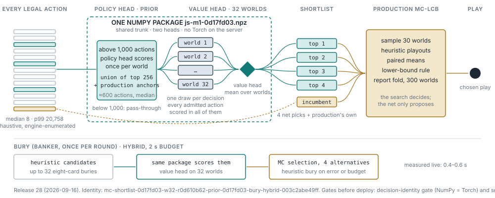

# Sheng Ji (升级 / Tractor)

**Play it now: https://shengji.fly.dev** — solo vs bots or share a room code
with friends (phones: landscape).

Full-stack implementation of the classic Chinese partnership trick-taking game:
Python rules engine + a learned-model-guided Monte Carlo AI + FastAPI
multiplayer server + React web UI with Mandarin voice announcements.

## The production bot — release 28 (2026-09-16)



One checkpoint, **JS-M1** (`a5248cc5`, served as the NumPy package
`js-m1-0d17fd03.npz`), does two jobs on every play decision:

1. **Prior (policy head).** When a position has more than 1,000 legal actions
   (wide throw follows), the policy head scores the actions once per sampled
   world; the union of each world's top 256 plus production's own anchors
   (about 600 actions, median) is all that goes forward. Below 1,000 actions
   nothing is pruned.
2. **Proposer (value head).** The admitted actions are scored across 32 shared
   sampled hidden worlds; the four best plus the incumbent form the shortlist.
3. **Decider (unchanged Monte Carlo search).** Production's MC-LCB search plays
   the shortlist out in 30 sampled worlds with heuristic rollouts, applies its
   lower-bound rule and re-checks the winner on a 300-world report fold. The
   net proposes; the search decides.

Bury is hybrid: heuristic candidates, scored by the same package, MC selection
with four alternatives, a 2 s budget with heuristic fallback. Declares are
heuristic. The engine runs the compiled fast path.

What the evidence says (details and provenance in
[AI_POLICIES.md](AI_POLICIES.md#production-contract), readouts in the
[scaling log](docs/scaling_log/) and the search atlas):

- JS-M1 is M1's recipe (a residual-trunk MLP on the afterstate encoding)
  trained from scratch on all 20.3M root decisions with a policy head at
  weight 0.2. Offline it beats M1 on the outcome head (val CE 0.5957 vs 0.5975)
  and its head is non-inferior to the separate prior on four of five strata, so
  one net can do both jobs without giving up either.
- **Release 28 shipped for maintainability, not for strength.** One checkpoint
  and one file replace two, so there is a single artifact to export, gate,
  version and roll back. In play it read `+0.0057 [−0.0163, +0.0277]` signed
  levels per round paired against release 27 at the same decision wall: no
  resolved difference, which is the bar it had to clear. (Against the older
  release 24 recipe, five capped windows read `+0.0239 [+0.0005, +0.0472]`,
  but that inherits M1's win rather than adding to it.) A fresh-deal check that
  the simplification did not cost strength is running.
- The prior is a latency device with no resolved strength effect: on paired
  seeds it changed outcomes by `−0.0003 [−0.0017, +0.0012]` while removing every
  decision over 60 s (0 in 365k fresh-deal decisions vs 161 for the old recipe).
- Every deploy passes two gates in `server/scripts/`: the decision-identity
  gate (the NumPy package reproduces the Torch checkpoint's decisions) and the
  server-path smoke (the server can take bury and play turns with the built
  bot). Release 25 passed the first alone and stalled live; the second exists
  because of it.

Rollbacks and release records: [DEPLOY.md](DEPLOY.md). The serving path
(packages, gate, smoke, `/healthz`): `DEPLOY.md` (the engineering record through release 28 is archived at [docs_archive/w32-fly-serving-through-2026-09-22.md](docs_archive/w32-fly-serving-through-2026-09-22.md)).
What comes next: [BACKLOG.md](BACKLOG.md) and [RL_PLAN.md](RL_PLAN.md).

## Quick start

```bash
# 1. Build the frontend (once, or after UI changes)
cd web && npm install && npm run build && cd ..

# 2. Run the server (serves the built UI at http://localhost:8000)
cd server && uv sync && uv run shengji-server
```

Open http://localhost:8000, create a room, add 3 bots (or share the room code
with friends on your network), and start. For frontend development use
`npm run dev` in `web/` (Vite on :5173, talks to the server on :8000).

Tests: `cd server && uv run pytest` (`SHENGJI_FAST=1` runs the compiled-engine
witnesses). Headless bot-vs-bot evaluation: `uv run python -m shengji.ai.env`.

## Rules implemented (standard 4-player, 2 decks)

- Teams 0+2 vs 1+3, levels 2→A; the banker team's level is the trump rank.
- Live dealing: any player may declare mid-deal by revealing trump-rank
  card(s) (pair beats single, joker pair declares no-trump and beats both),
  with a short grace window for over-declarations; no declaration → trump is
  flipped from the kitty. The first round's first declarer becomes banker.
- Banker takes the 8-card kitty and buries 8.
- Pairs, tractors (consecutive pairs, trump-aware adjacency incl. rank cards
  and jokers) and throws (甩牌); an invalid throw is forced down to its lowest
  component.
- Follow rules: follow suit with matching count; pairs must cover pair leads;
  tractor leads oblige an in-suit tractor of that length when you hold one;
  void hands may trump with a shape-matching play.
- Points: 5s=5, 10s/Ks=10 (200 total). Attackers win at 80; taking the last
  trick multiplies kitty points by 2 × the size of the winning play.
- Scoring: attackers 0 → banker +3, <40 → +2, <80 → +1; attackers 80+ take the
  deal and gain (points−80)/40 levels. The game is won by **defending** at
  level A.

House rules (v1): throws are checked against all three other hands with no
10-point penalty; pair obligations for multi-component throws use the
pair-count rule.

## Layout

```
server/shengji/engine/   cards, combos (tractor decomposition), legality, round, game
server/shengji/ai/       policies: heuristic.py, smart.py + memory.py (card-counting
                         heuristic), mcbot.py (the Monte Carlo search), cwv_numpy.py
                         (the Torch-free package runtime), registry.py (SHENGJI_BOT
                         names are derived from the fly.toml env, never hand-written)
server/shengji/train/    the shortlist bot, prior admission, bury policy, screens
server/shengji/rl/       encoders, action enumeration, the value/policy model, trainer
server/shengji/api/      FastAPI WebSocket server (rooms, bots, per-seat state)
server/scripts/          export_cwv_numpy.py, cwv_serving_gate.py, cwv_serving_smoke.py,
                         replay.py, xray.py
server/tests/            unit tests + randomized self-play soak tests
web/                     React + TypeScript UI (Vite)
PROTOCOL.md              WebSocket protocol contract
```

The engine is authoritative and UI-free; the server maps card instance ids to
codes per seat so hidden information never leaves the server.

## Other policies in the registry

`mc-s0-report-lcb` is the bare MC-LCB search (the screen baseline and the deep
rollback); release 27's two-file recipe (M1 value package + separate prior v2)
is the first rollback; `smart` and `heuristic` are the hand-written baselines.
Closed lanes (G1's grid trunk in play, the PUCT ladder with the heads, the
BELIEF and privileged-teacher teachers, direct-Q, Suphx O0) are recorded as
lessons in [AI_POLICIES.md](AI_POLICIES.md) and [RL_PLAN.md](RL_PLAN.md), not
as policies.

## Debugging & analysis tools

- `scripts/replay.py` — render any room log (`logs/<ROOM>.jsonl`) as a full
  transcript with all hands.
- `scripts/xray.py` / the in-game X-ray (press `x`; needs
  `SHENGJI_DEBUG_TOKEN`) — what the bot sees and would play from any position:
  W32 nominations, MC selection estimates and the paired report-gap decision,
  with the checkpoint, recipe, search work and measured times labelled. It
  evaluates an isolated snapshot and never changes the live bot's RNG.
- `scripts/fetch_fly_logs.sh` — stage, validate, refresh and hash prod logs.
- `python -m shengji.rl.human_shards` — build a replay-audited human play/bury
  corpus (raw human choices are proposal data until counterfactually validated).

## Project docs

| file | what it holds |
|---|---|
| `AI_POLICIES.md` | the production contract, every measured policy and durable conclusion |
| `RL_PLAN.md` | decision tree, key learnings, measurement rules |
| `BACKLOG.md` | current milestone, ordered work, blockers and exit gates |
| `DEPLOY.md` | release records, rollbacks, the served modes and their gates |
| issue #208 / `docs/scaling_log/` | engine/search speed (the dated record through 2026-09-22 is archived at `docs_archive/perf-through-2026-09-22.md`) |
| `incidents/` / `server/tests/` | postmortems and the validation suite (the correctness ledger through 2026-09-22 is archived at `docs_archive/correctness-through-2026-09-22.md`) |
| `docs/scaling_log/` | every value model, its offline metrics and screen results (built from `models.py`) |
| `AGENTS.md` / `CODEX_WORKFLOW.md` | execution discipline and the Codex setup (the daily routine is archived at `docs_archive/maintenance-through-2026-09-22.md`) |
| `PROTOCOL.md` | the evidence protocol; the earlier doctrine is archived at `docs_archive/research-principles-through-2026-09-22.md` |
| `HANDOFF_ACTIVE.md` / `HANDOFF_REVIEW.md` | current gate summary; the append-only review ledger on `main` |
| `PROTOCOL.md` / `web/README.md` | wire protocol; client architecture and UI invariants |
| `docs_archive/` | compacted history: closed lanes, old designs (incl. the privileged-teacher docs), rotated handoffs |

Top-level documents are reserved for current project, operational or durable
contract surfaces; completed one-off specs are summarized in their owner and
moved to `docs_archive/`.
