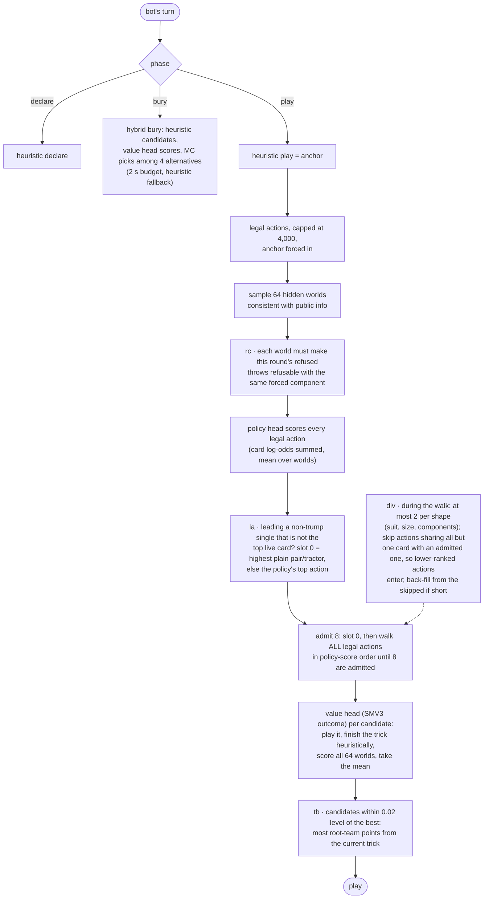

# Sheng Ji (升级 / Tractor)

**Play it now: https://shengji.fly.dev** — solo vs bots or share a room code
with friends (phones: landscape).

The classic Chinese partnership trick-taking game: Python rules engine, Monte
Carlo AI guided by a learned model, FastAPI multiplayer server, and React web UI
with Mandarin voice announcements.

## The production bot

**Live: release 38** (deployed 2026-10-03 09:41 ET; model since release 36, 2026-09-30): the
SMV3 outcome-head package `smv3out-491ee4bf.npz` in release 30's policy/value search, plus four
search rules (div, rc, tb, la in the diagram), served as
`pv-search-491ee4bf-w64-k8-div-rc-tb-la-r7092480e-bury-hybrid-5517ddbd7457`.
Every new screen compares against release 38 as served.


```mermaid
flowchart TD
  turn(["bot's turn"]) --> phase{phase}
  phase -->|declare| dec["heuristic declare"]
  phase -->|bury| bury["hybrid bury: heuristic candidates,<br/>value head scores, MC picks among 4 alternatives<br/>(2 s budget, heuristic fallback)"]
  phase -->|play| anchor["heuristic play = anchor"]
  anchor --> legal["legal actions, capped at 4,000,<br/>anchor forced in"]
  legal --> worlds["sample 64 hidden worlds<br/>consistent with public info"]
  worlds --> rc["rc · each world must make this round's refused<br/>throws refusable with the same forced component"]
  rc --> prior["policy head scores every legal action<br/>(card log-odds summed, mean over worlds)"]
  prior --> la["la · leading a non-trump single that is not the<br/>top live card? slot 0 = highest plain pair/tractor,<br/>else the policy's top action"]
  la --> admit["admit 8: slot 0, then walk ALL legal actions<br/>in policy-score order until 8 are admitted"]
  div["div · during the walk: at most 2 per shape<br/>(suit, size, components); skip actions sharing all but<br/>one card with an admitted one, so lower-ranked actions<br/>enter; back-fill from the skipped if short"] -.-> admit
  admit --> value["value head (SMV3 outcome) per candidate:<br/>play it, finish the trick heuristically,<br/>score all 64 worlds, take the mean"]
  value --> tb["tb · candidates within 0.02 level of the best:<br/>most root-team points from the current trick"]
  tb --> play(["play"])
```

Releases 36–37 ran this path without the four rules (slot 0 always the heuristic play, the seven
best-scored actions admitted unfiltered, plain argmax). Play has a 3 s cooperative budget; on
expiry the bot plays the heuristic anchor. Source:
`server/shengji/train/pv_search_policy.py`, `policy_value_search.py`, `ai/refusal.py`.

**Served results** (signed levels per round, 95% CI). Each arm is read against a common MC-LCB
control, so these are indirect contrasts, not head-to-head win rates.

| change | against | result | reading |
|---|---|---|---|
| div + rc + tb | release 36 | +0.0461 [+0.0242, +0.0681] | CONFIRMED, ten fresh windows (#676) |
| + la | div + rc + tb | +0.0106 [+0.0006, +0.0205] | POSITIVE incremental (not a confirmation): small, ten windows, lower bound near zero (#676) |
| SMV3 outcome head (release 36) | release 30 | +0.0393 [+0.0033, +0.0752] | predeclared confirmation (#663) |
| policy/value search (release 29) | release 28 | +0.049 [+0.003, +0.095] | five windows; card play +0.086 [+0.042, +0.131] |
| adaptive K16 | release 36 | −0.0061 [−0.0303, +0.0181] | inconclusive, not taken |
| PUCT (package prior / uniform) | release 36 | −0.417 / −0.894 | closed (#436) |

Each of div, rc, tb alone was unconfirmed or inconclusive; only their combination confirmed.
Lead-anchor alone vs release 36 was positive exploratory (+0.0138 [+0.0013, +0.0262], five
windows, below the extension triage).
Every production change and its receipt: [AI_POLICIES.md](AI_POLICIES.md#the-ladder-every-production-change-and-what-it-measured).
Rollback, gates and release records: [DEPLOY.md](DEPLOY.md). Open investigations: the board
issue #679. Next work: [BACKLOG.md](BACKLOG.md), [RL_PLAN.md](RL_PLAN.md).

## Quick start

```bash
# 1. Build the frontend (once, or after UI changes)
cd web && npm install && npm run build && cd ..

# 2. Run the server (serves the built UI at http://localhost:8000)
cd server && uv sync && uv run shengji-server
```

Open http://localhost:8000, create a room, add 3 bots (or share the room code
with friends on your network), and start. For frontend development, run
`npm run dev` in `web/` (Vite on :5173, talks to the server on :8000).

Tests: `cd server && uv run pytest` (`SHENGJI_FAST=1` runs the compiled-engine
witnesses). Headless bot-vs-bot evaluation: `uv run python -m shengji.ai.env`.

## Rules implemented (standard 4-player, 2 decks)

- Teams 0+2 vs 1+3 climb levels 2 to A; the banker team's level is the trump rank.
- Live dealing: anyone may declare mid-deal by revealing trump-rank card(s).
  A pair beats a single; a joker pair declares no-trump and beats both.
  A short grace window allows over-declarations. With no declaration, trump
  is flipped from the kitty. The first round's first declarer becomes banker.
- Banker takes the 8-card kitty and buries 8.
- Pairs, tractors (consecutive pairs, trump-aware adjacency incl. rank cards
  and jokers) and throws (甩牌); an invalid throw is forced down to its lowest
  component.
- Follow suit with matching count; pairs must cover pair leads; a tractor lead
  obliges an in-suit tractor of that length if you hold one; a void hand may
  trump with a shape-matching play.
- Points: 5s=5, 10s/Ks=10 (200 total). Attackers win at 80; taking the last
  trick multiplies kitty points by 2 × the size of the winning play.
- Scoring: attackers at 0 give the banker +3, under 40 +2, under 80 +1;
  attackers at 80+ take the deal and gain (points−80)/40 levels. The game is
  won by **defending** at level A.

House rules (v1): throws are checked against all three other hands with no
10-point penalty; pair obligations for multi-component throws use the
pair-count rule.

## Layout

```
server/shengji/engine/   cards, combos (tractor decomposition), legality, round, game
server/shengji/ai/       policies: heuristic.py, smart.py + memory.py (card-counting
                         heuristic), mcbot.py (the Monte Carlo search), cwv_numpy.py
                         (the Torch-free package runtime), refusal.py (refusal-aware
                         world sampling), registry.py (SHENGJI_BOT names are derived
                         from the fly.toml env, never hand-written)
server/shengji/train/    pv_search_policy.py + policy_value_search.py (the served play
                         search), cwv_bury_policy.py (hybrid bury), the shortlist-era
                         bots, screens
server/shengji/rl/       encoders, action enumeration, the value/policy model, trainer
server/shengji/api/      FastAPI WebSocket server (rooms, bots, per-seat state)
server/scripts/          export_cwv_numpy.py, cwv_serving_gate.py, cwv_serving_smoke.py,
                         replay.py, xray.py
server/tests/            unit tests + randomized self-play soak tests
web/                     React + TypeScript UI (Vite)
PROTOCOL.md              WebSocket protocol contract
```

The engine is authoritative and UI-free; the server maps card instance ids to
codes per seat so hidden information never leaves the server.

## Other policies in the registry

- `mc-s0-report-lcb`: the bare MC-LCB search; the common control of every served screen and
  the deep rollback.
- The shortlist-era packages (releases 22–28): registered rollbacks (order in [DEPLOY.md](DEPLOY.md)).
- `smart` and `heuristic`: the hand-written baselines.

Closed lanes (G1's grid trunk in play, PUCT with the heads, root allocation, the BELIEF and
privileged-teacher teachers, direct-Q, Suphx O0) are lessons in
[AI_POLICIES.md](AI_POLICIES.md) and [RL_PLAN.md](RL_PLAN.md), not policies.

## Debugging & analysis tools

- `scripts/replay.py` — render any room log (`logs/<ROOM>.jsonl`) as a full
  transcript with all hands.
- `scripts/xray.py` / the in-game X-ray (press `x`; needs
  `SHENGJI_DEBUG_TOKEN`) — what the bot sees and would play from any position,
  on an isolated snapshot (the live bot's RNG is untouched). It decodes
  shortlist-era records (W32 nominations, MC selection estimates, the report-gap
  decision). For the pv-search bot it shows the pick and the bot's memory, not
  the admitted candidates' value means.
- `scripts/fetch_fly_logs.sh` — stage, validate, refresh and hash prod logs.
- `python -m shengji.rl.human_shards` — build a replay-audited human play/bury
  corpus (raw human choices are proposal data until counterfactually validated).

## Project docs

| file | what it holds |
|---|---|
| `AI_POLICIES.md` | the production contract, every measured policy and durable conclusion, the evidence standard (research doctrine archived at `docs_archive/research-principles-through-2026-09-22.md`) |
| `RL_PLAN.md` | decision tree, key learnings, measurement rules |
| `BACKLOG.md` | current milestone, ordered work, blockers and exit gates |
| `DEPLOY.md` | release records, rollbacks, the served modes and their gates |
| issue #208 / `docs/scaling_log/` | engine/search speed (the dated record through 2026-09-22 is archived at `docs_archive/perf-through-2026-09-22.md`) |
| `incidents/` / `server/tests/` | postmortems and the validation suite (the correctness ledger through 2026-09-22 is archived at `docs_archive/correctness-through-2026-09-22.md`) |
| `docs/scaling_log/` / `docs/atlas_v2/` | every model with its offline metrics (built from `models.py`); every screen since release 29 (built from `registry.json`) |
| GitHub issue #679 + topic issues | the live investigation board, updated hourly; topics: #663 model, #676 search screens, #436 PUCT/allocation, #355 Sol benchmark, #681 mistake audit |
| `AGENTS.md` | execution discipline and agent orchestration (the daily routine is archived at `docs_archive/maintenance-through-2026-09-22.md`) |
| `HANDOFF_REVIEW.md` | frozen to its authority markers (#674); prose lives on GitHub issues, archived text in `docs_archive/handoff-review-*.md`. `HANDOFF_ACTIVE.md` was deleted (#674); fleet state is `server/scripts/fleet_status.sh` |
| `PROTOCOL.md` / `web/README.md` | wire protocol; client architecture and UI invariants |
| `docs_archive/` | compacted history: closed lanes, old designs (incl. the privileged-teacher docs), rotated handoffs |

Top-level documents hold only current project, operational or durable contract
surfaces. Completed one-off specs are summarized in their owner and moved to
`docs_archive/`.
